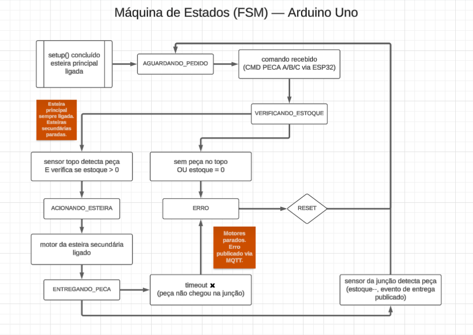
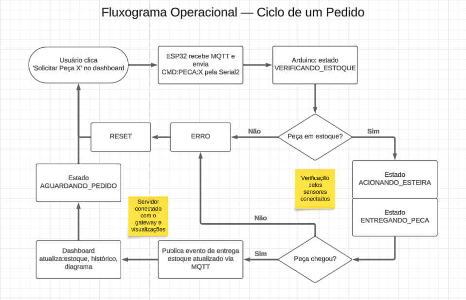

# Fluxograma de Funcionamento — Data Flow Inventory

> Item 3.8 do cronograma Gantt. Diagramas em [Mermaid](https://mermaid.js.org/), renderizados nativamente pelo GitHub.
>
> **Para exportar como imagem (artigo):** copie o código do diagrama e cole em [mermaid.live](https://mermaid.live) → *Actions* → *PNG/SVG*.

---

## 1. Máquina de Estados (FSM) — Arduino Uno

Os 5 estados do firmware e suas transições:

---

## 2. Fluxograma Operacional — Ciclo de um Pedido

Visão de processo: da solicitação do usuário no dashboard até a entrega da peça.

---

---

## Observações

- **Botões físicos desabilitados:** o controle é feito exclusivamente pelo dashboard (comandos via MQTT). Os botões permanecem no hardware para eventual fallback.
- **Modo simulador:** no simulador (`simulator/`), a FSM acima roda em JavaScript e as etapas de MQTT/ESP32/Arduino são substituídas por temporizadores — o frontend recebe exatamente os mesmos eventos Socket.IO.
- **Separador (roda giratória):** ainda não incluído no fluxo — será adicionado ao fluxograma quando o motor for definido e o código habilitado.