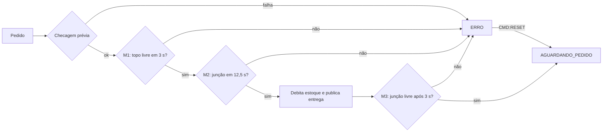

# Firmware do Uno v3.0 — Supervisão por marcos e robustez — Plano de Implementação

> **Para agentes de execução:** SUB-SKILL OBRIGATÓRIA: use superpowers:subagent-driven-development (recomendado) ou superpowers:executing-plans para executar este plano tarefa a tarefa. Os passos usam caixas de seleção (`- [ ]`).

**Objetivo:** Reestruturar o firmware do Arduino Uno em módulos (lógica pura testável no PC + camada de hardware fina) com supervisão da entrega por marcos, watchdog, causa do reset e tolerância a falhas de periféricos, mantendo intacta a conversa com o ESP32 e o servidor.

**Arquitetura:** `src/logica/` contém regras em C++ puro (protocolo, filtro, supervisor, FSM, telas, causa do reset), compiladas e testadas no PC com g++ (Docker local, Ubuntu no CI). `src/hw/` liga essas regras aos pinos, à serial, ao LCD e ao watchdog. O `.ino` só orquestra. Textos fixos ficam na flash (`TXT()`), e o JSON é montado sem ArduinoJson, com testes de contrato que reproduzem byte a byte as mensagens do firmware v2.x.

**Stack:** Arduino Uno (ATmega328P, AVR core 1.8.x), C++11, `LiquidCrystal_I2C`, `Wire`, `avr/wdt.h`; g++ 14 (imagem Docker `gcc:14`) para os testes; `arduino-cli` para compilar.

**Spec:** `docs/superpowers/specs/2026-10-03-firmware-uno-v3-design.md` (autoridade; em conflito, o spec vence).

## Refinamentos em relação ao spec

- **Sem ArduinoJson no Uno:** o JSON é montado por `src/logica/protocolo` (sem printf), com testes de contrato byte a byte contra o formato v2.x. Isso elimina o risco "ArduinoJson 6 vs 7" do spec e libera RAM. O CI continua instalando a biblioteca (o ESP32 usa).
- **Textos na flash (`TXT()`):** a primeira versão compilada usava 85% da RAM porque, no AVR, todo literal ocupa RAM. Com `PROGMEM` a RAM global caiu para 46% (o v2.x usava 55%).
- **Módulos lógicos a mais:** `protocolo`, `telas`, `causa_reset` e `texto_flash` saíram de dentro dos módulos de hardware para serem testáveis no PC. Os nomes de erro viraram `enum` (`TipoErro`).
- **Código já validado:** todo o código deste plano foi compilado para o Uno e testado no PC antes de o plano ser escrito; as contagens de testes de cada tarefa (17, 21, 27, 37, 38) foram conferidas.

## Restrições Globais

- **Nada pode quebrar o funcionamento parcial atual:** as mensagens JSON do v2.x (`status`, `estoque`, `sensores`, `esteiras`, eventos `pedido`, `entrega`, `erro`, `inicio`) continuam **idênticas byte a byte**; só entram campos opcionais **no fim** e novos valores de `tipo`. Os testes de contrato da Tarefa 1 guardam isso.
- **Não mexer no ESP32 nem no servidor** (`esp32/`, `server/`, `frontend/`, `simulator/` intocados).
- Comandos aceitos: `CMD:PECA:` + uma letra (A, B ou C) e `CMD:RESET`. Serial a **9600 baud**, linhas terminadas em `\r\n`.
- Pinos inalterados: motores A=9, B=10, C=11; topo A0/A1/A2; junção J1=A3, J2=D2, J3=D4; LCD I²C (A4/A5).
- Estoque inicial **15**, sem persistência; o `inicio` informa a causa do reset.
- Débito **somente** na confirmação válida da junção da esteira pedida.
- Parâmetros por esteira (padrão A, B e C): PWM 200, kick 150 ms, partida 3000 ms, timeout 12500 ms, saída 3000 ms, pulso mínimo da junção 20 ms.
- RAM global do Uno **≤ 65%** (verificado na compilação). Arquivos de `src/logica/` **não** incluem `Arduino.h`.
- Idioma de código, comentários, mensagens e documentação: **português do Brasil**.
- Trailer de todo commit: `Co-Authored-By: Claude Opus 5.5 <noreply@anthropic.com>`.
- Não colar cercas de markdown (três crases) em arquivos que não sejam `.md`.
- `core.autocrlf=true`: o aviso "LF will be replaced by CRLF" é esperado.
- Nunca matar processos que você não iniciou.

## Como rodar as verificações

- **Testes da lógica (PC):** Docker Desktop precisa estar aberto. Na raiz do repositório:

```bash
MSYS_NO_PATHCONV=1 docker run --rm -v "$(cygpath -w "$PWD"):/w" -w /w gcc:14 make -C test/firmware_uno test
```

- **Compilação do Uno:** o `arduino-cli` vem com a Arduino IDE nesta máquina:

```bash
CLI="/c/Users/matheusn/AppData/Local/Programs/Arduino IDE/resources/app/lib/backend/resources/arduino-cli.exe"
"$CLI" compile --fqbn arduino:avr:uno --warnings all arduino/data_flow_inventory
```

## Mapa de arquivos

| Arquivo | Tarefa | Responsabilidade |
|---|---|---|
| `test/firmware_uno/teste.h`, `principal.cpp`, `Makefile` | 1 | mini-framework de testes e build no PC |
| `src/logica/texto_flash.h` | 1 | `TXT()`/`lerTxt()`: textos na flash do AVR |
| `src/logica/protocolo.h/.cpp` + `teste_protocolo.cpp` | 1 | comandos e mensagens JSON (contrato v2.x) |
| `src/logica/filtro_entrada.h/.cpp`, `causa_reset.h/.cpp` + `teste_filtro_reset.cpp` | 2 | debounce por tempo; causa do reset |
| `src/logica/supervisor_entrega.h/.cpp` + `teste_supervisor.cpp` | 3 | marcos M1/M2/M3 |
| `src/logica/fsm.h/.cpp` + `teste_fsm.cpp` | 4 | 5 estados, comandos, estoque, eventos |
| `src/logica/telas.h/.cpp` + `teste_telas.cpp` | 5 | textos do LCD 16x2 |
| `config.h`, `src/hw/*`, `data_flow_inventory.ino`, CI | 6 | hardware, troca do firmware, CI |
| `docs/...` | 7 | documentação e roteiro de bancada |
| — | 8 | verificação final |

Caminhos `src/...` acima são relativos a `arduino/data_flow_inventory/`.

---

### Tarefa 1: Infra de testes no PC e protocolo serial (contrato v2.x)

**Arquivos:**
- Criar: `test/firmware_uno/teste.h`, `test/firmware_uno/principal.cpp`, `test/firmware_uno/Makefile`
- Criar: `arduino/data_flow_inventory/src/logica/texto_flash.h`, `protocolo.h`, `protocolo.cpp`
- Teste: `test/firmware_uno/teste_protocolo.cpp`
- Modificar: `.gitignore` (binário dos testes), `.github/workflows/lint-and-security.yaml` (job `firmware-logica`)

**Interfaces:**
- Produz: `ComandoTipo interpretarComando(const char* linha, char* peca)`; `LeitorLinha` + `leitorIniciar`/`leitorAlimentar`; `formatarStatus/Estoque/Sensores/Esteiras/Pedido/Entrega/Erro/Inicio(char* buf, size_t cap, ...)` (devolvem o tamanho ou 0); macro `TXT(s)` e `lerTxt(p)`. Textos fixos passados às funções `formatar*` são `TXT(...)`.

**Contexto:** o firmware atual (v2.x, `arduino/data_flow_inventory/data_flow_inventory.ino`) publica JSON com ArduinoJson. Os testes desta tarefa fixam o formato exato dessas mensagens; o novo código monta o JSON à mão (sem printf, sem ArduinoJson) e precisa reproduzi-lo byte a byte. O `.ino` atual **não muda** nesta tarefa (a troca é na Tarefa 6).

- [ ] **Passo 1: Mini-framework e build**

Crie `test/firmware_uno/teste.h` com exatamente este conteúdo:

```cpp
// Mini-framework de testes do firmware (sem dependências externas).
#pragma once
#include <stdio.h>
#include <string.h>

namespace teste {
inline int& falhas() { static int n = 0; return n; }
inline int& total() { static int n = 0; return n; }
typedef void (*FuncaoTeste)();
struct Registro { const char* nome; FuncaoTeste f; Registro* prox; };
inline Registro*& lista() { static Registro* r = nullptr; return r; }
struct Registrar {
  Registro r;
  Registrar(const char* nome, FuncaoTeste f) {
    r.nome = nome; r.f = f; r.prox = nullptr;
    Registro** p = &lista();
    while (*p) p = &(*p)->prox;  // mantém a ordem de declaração
    *p = &r;
  }
};
}  // namespace teste

#define TESTE(nome)                                              \
  static void nome();                                            \
  static teste::Registrar registro_##nome(#nome, nome);          \
  static void nome()

#define VERIFICA(cond)                                                       \
  do {                                                                       \
    teste::total()++;                                                        \
    if (!(cond)) {                                                           \
      teste::falhas()++;                                                     \
      printf("  FALHA %s:%d: %s\n", __FILE__, __LINE__, #cond);              \
    }                                                                        \
  } while (0)

#define VERIFICA_TEXTO(a, b)                                                 \
  do {                                                                       \
    teste::total()++;                                                        \
    if (strcmp((a), (b)) != 0) {                                             \
      teste::falhas()++;                                                     \
      printf("  FALHA %s:%d:\n    obtido:   %s\n    esperado: %s\n",         \
             __FILE__, __LINE__, (a), (b));                                  \
    }                                                                        \
  } while (0)
```

Crie `test/firmware_uno/principal.cpp` com exatamente este conteúdo:

```cpp
// Executor dos testes do firmware: roda todos os TESTE(...) registrados.
#include "teste.h"

int main() {
  int nTestes = 0;
  for (teste::Registro* r = teste::lista(); r; r = r->prox) {
    int antes = teste::falhas();
    r->f();
    nTestes++;
    printf("%s %s\n", teste::falhas() == antes ? "ok  " : "FALHOU", r->nome);
  }
  printf("\n%d testes, %d verificacoes, %d falhas\n", nTestes, teste::total(), teste::falhas());
  return teste::falhas() == 0 ? 0 : 1;
}
```

Crie `test/firmware_uno/Makefile` com exatamente este conteúdo:

```make
# Testes da lógica pura do firmware do Uno (compila no PC com g++).
# Uso: make -C test/firmware_uno test
LOGICA := ../../arduino/data_flow_inventory/src/logica
CXX ?= g++
CXXFLAGS := -std=c++11 -Wall -Wextra -Werror -O1 -I$(LOGICA)

FONTES_LOGICA := $(wildcard $(LOGICA)/*.cpp)
FONTES_TESTE := principal.cpp $(wildcard teste_*.cpp)

.PHONY: test clean
test: testes
	./testes

testes: $(FONTES_LOGICA) $(FONTES_TESTE) teste.h $(wildcard $(LOGICA)/*.h)
	$(CXX) $(CXXFLAGS) -o $@ $(FONTES_TESTE) $(FONTES_LOGICA)

clean:
	rm -f testes
```

Acrescente ao final do `.gitignore`:

```
# Binário dos testes da lógica do firmware (test/firmware_uno)
test/firmware_uno/testes
```

- [ ] **Passo 2: Escrever os testes de contrato (falham: o módulo não existe)**

Crie `test/firmware_uno/teste_protocolo.cpp` com exatamente este conteúdo:

```cpp
// Contrato do protocolo serial. As strings "esperado" reproduzem byte a
// byte o que o firmware v2.x (ArduinoJson) publicava: se um destes testes
// quebrar, o ESP32/servidor/dashboard podem deixar de entender o Uno.
#include "protocolo.h"
#include "teste.h"

static char buf[160];  // mesmo tamanho do buffer do firmware (src/hw/comunicacao.cpp)

// ---- Mensagens existentes (formato v2.x, sem campos novos) ----------------

TESTE(status_igual_v2) {
  formatarStatus(buf, sizeof buf, "AGUARDANDO_PEDIDO", 0, 42, -1);
  VERIFICA_TEXTO(buf, "{\"type\":\"status\",\"estado\":\"AGUARDANDO_PEDIDO\",\"pecaSolicitada\":0,\"uptime\":42}");
}

TESTE(estoque_igual_v2) {
  const int est[3] = {15, 14, 0};
  formatarEstoque(buf, sizeof buf, est);
  VERIFICA_TEXTO(buf, "{\"type\":\"estoque\",\"pecaA\":15,\"pecaB\":14,\"pecaC\":0}");
}

TESTE(sensores_igual_v2) {
  const bool topo[3] = {true, false, true};
  const bool jun[3] = {false, true, false};
  formatarSensores(buf, sizeof buf, topo, jun);
  VERIFICA_TEXTO(buf, "{\"type\":\"sensores\",\"topo\":{\"A\":1,\"B\":0,\"C\":1},\"juncao\":{\"J1\":0,\"J2\":1,\"J3\":0}}");
}

TESTE(esteiras_igual_v2) {
  const bool sec[3] = {false, true, false};
  formatarEsteiras(buf, sizeof buf, sec);
  VERIFICA_TEXTO(buf, "{\"type\":\"esteiras\",\"principal\":1,\"secA\":0,\"secB\":1,\"secC\":0}");
}

TESTE(pedido_igual_v2) {
  formatarPedido(buf, sizeof buf, 'B');
  VERIFICA_TEXTO(buf, "{\"type\":\"evento\",\"evento\":\"pedido\",\"peca\":\"B\"}");
}

TESTE(entrega_igual_v2) {
  const int est[3] = {15, 14, 15};
  formatarEntrega(buf, sizeof buf, 'B', est);
  VERIFICA_TEXTO(buf, "{\"type\":\"evento\",\"evento\":\"entrega\",\"peca\":\"B\",\"estoqueA\":15,\"estoqueB\":14,\"estoqueC\":15}");
}

TESTE(erro_igual_v2_com_e_sem_peca) {
  formatarErro(buf, sizeof buf, "ocupado", 'C', nullptr, -1, -1);
  VERIFICA_TEXTO(buf, "{\"type\":\"evento\",\"evento\":\"erro\",\"tipo\":\"ocupado\",\"peca\":\"C\"}");
  formatarErro(buf, sizeof buf, "peca_invalida", 0, nullptr, -1, -1);
  VERIFICA_TEXTO(buf, "{\"type\":\"evento\",\"evento\":\"erro\",\"tipo\":\"peca_invalida\"}");
}

TESTE(inicio_igual_v2_sem_campos_novos) {
  formatarInicio(buf, sizeof buf, "2.1", nullptr, -1, -1);
  VERIFICA_TEXTO(buf, "{\"type\":\"evento\",\"evento\":\"inicio\",\"msg\":\"Sistema iniciado\",\"versao\":\"2.1\",\"driver\":\"IRF520\"}");
}

// ---- Campos novos: sempre DEPOIS dos atuais e só quando informados ---------

TESTE(status_com_ram_livre) {
  formatarStatus(buf, sizeof buf, "ERRO", 2, 4294967295UL, 812);
  VERIFICA_TEXTO(buf, "{\"type\":\"status\",\"estado\":\"ERRO\",\"pecaSolicitada\":2,\"uptime\":4294967295,\"ram_livre\":812}");
}

TESTE(erro_com_diagnostico) {
  formatarErro(buf, sizeof buf, "timeout", 'B', "transito", 12503, 0);
  VERIFICA_TEXTO(buf, "{\"type\":\"evento\",\"evento\":\"erro\",\"tipo\":\"timeout\",\"peca\":\"B\",\"fase\":\"transito\",\"t_ms\":12503,\"bordas_juncao\":0}");
}

TESTE(inicio_com_campos_novos) {
  formatarInicio(buf, sizeof buf, "3.0", "watchdog", 0, 640);
  VERIFICA_TEXTO(buf, "{\"type\":\"evento\",\"evento\":\"inicio\",\"msg\":\"Sistema iniciado\",\"versao\":\"3.0\",\"driver\":\"IRF520\",\"reset\":\"watchdog\",\"lcd\":false,\"ram_livre\":640}");
}

TESTE(maiores_mensagens_cabem_no_buffer_de_160_bytes) {
  const bool t[3] = {true, true, true};
  VERIFICA(formatarSensores(buf, sizeof buf, t, t) > 0);
  VERIFICA(formatarErro(buf, sizeof buf, "peca_presa_saida", 'C', "transito", 2147483647L, 255) > 0);
  VERIFICA(formatarInicio(buf, sizeof buf, "3.0", "reinicio", 1, 2048) > 0);
  VERIFICA(strlen(buf) < 160);
}

TESTE(buffer_pequeno_devolve_zero_e_string_vazia) {
  char pequeno[10];
  VERIFICA(formatarPedido(pequeno, sizeof pequeno, 'A') == 0);
  VERIFICA_TEXTO(pequeno, "");
}

// ---- Comandos -------------------------------------------------------------------

TESTE(comandos_validos) {
  char p;
  VERIFICA(interpretarComando("CMD:PECA:A", &p) == CMD_PECA && p == 'A');
  VERIFICA(interpretarComando("CMD:PECA:C", &p) == CMD_PECA && p == 'C');
  VERIFICA(interpretarComando("  CMD:PECA:B \r", &p) == CMD_PECA && p == 'B');
  VERIFICA(interpretarComando("CMD:RESET", &p) == CMD_RESET && p == 0);
}

TESTE(comandos_invalidos) {
  char p;
  VERIFICA(interpretarComando("", &p) == CMD_NENHUM);
  VERIFICA(interpretarComando("   ", &p) == CMD_NENHUM);
  VERIFICA(interpretarComando("CMD:PECA:", &p) == CMD_PECA_INVALIDA);
  VERIFICA(interpretarComando("CMD:PECA:Z", &p) == CMD_PECA_INVALIDA && p == 0);
  VERIFICA(interpretarComando("CMD:PECA:AB", &p) == CMD_PECA_INVALIDA);
  VERIFICA(interpretarComando("CMD:PECA:a", &p) == CMD_PECA_INVALIDA);
  VERIFICA(interpretarComando("CMD:RESETX", &p) == CMD_DESCONHECIDO);
  VERIFICA(interpretarComando("{\"type\":\"x\"}", &p) == CMD_DESCONHECIDO);
}

TESTE(leitor_monta_linhas_e_ignora_cr) {
  LeitorLinha l;
  leitorIniciar(l);
  const char* entrada = "CMD:PE";
  for (const char* c = entrada; *c; c++) VERIFICA(!leitorAlimentar(l, *c));
  const char* resto = "CA:A\r\n";
  bool pronto = false;
  for (const char* c = resto; *c; c++) pronto = leitorAlimentar(l, *c);
  VERIFICA(pronto);
  VERIFICA_TEXTO(l.buf, "CMD:PECA:A");
}

TESTE(leitor_descarta_linha_longa_inteira) {
  LeitorLinha l;
  leitorIniciar(l);
  for (int i = 0; i < 50; i++) VERIFICA(!leitorAlimentar(l, 'x'));
  VERIFICA(!leitorAlimentar(l, '\n'));  // a linha longa some inteira
  const char* prox = "CMD:RESET\n";
  bool pronto = false;
  for (const char* c = prox; *c; c++) pronto = leitorAlimentar(l, *c);
  VERIFICA(pronto);
  VERIFICA_TEXTO(l.buf, "CMD:RESET");
}
```

- [ ] **Passo 3: Rodar e ver falhar**

Rode (na raiz do repositório, Git Bash):

```bash
MSYS_NO_PATHCONV=1 docker run --rm -v "$(cygpath -w "$PWD"):/w" -w /w gcc:14 make -C test/firmware_uno test
```

Esperado: erro de compilação `protocolo.h: No such file or directory`.

- [ ] **Passo 4: Implementar**

Crie `arduino/data_flow_inventory/src/logica/texto_flash.h` com exatamente este conteúdo:

```cpp
// ============================================================
// DATA FLOW INVENTORY — Textos fixos na memória flash
// ------------------------------------------------------------
// No AVR, um literal "..." ocupa RAM (o Uno só tem 2 KB). TXT("...")
// grava o texto na flash (PROGMEM) e lerTxt() lê um caractere dele.
// No PC (testes) os dois viram o comportamento normal de C++.
// Convenção: todo `const char*` de texto FIXO nas APIs de src/logica
// é um TXT (flash no AVR). Textos montados em RAM (buffers) não são.
// ============================================================
#pragma once

#if defined(__AVR__)
#include <avr/pgmspace.h>
#define TXT(s) PSTR(s)
inline char lerTxt(const char* p) { return (char)pgm_read_byte(p); }
#else
#define TXT(s) (s)
inline char lerTxt(const char* p) { return *p; }
#endif
```

Crie `arduino/data_flow_inventory/src/logica/protocolo.h` com exatamente este conteúdo:

```cpp
// ============================================================
// DATA FLOW INVENTORY — Protocolo serial Uno ↔ ESP32 (lógica pura)
// ------------------------------------------------------------
// Interpreta comandos (CMD:PECA:X, CMD:RESET) e formata as mensagens
// JSON publicadas pelo Uno. C++ puro, sem Arduino.h: testado no PC
// (test/firmware_uno). O formato de cada mensagem é idêntico ao do
// firmware v2.x (ArduinoJson): mesma ordem de campos, sem espaços.
// Campos novos são sempre OPCIONAIS (só saem quando informados).
// Textos fixos passados às funções formatar* (estado, tipo, fase, versão,
// reset) devem ser TXT(...) — ver texto_flash.h.
// ============================================================
#pragma once
#include <stddef.h>
#include <stdint.h>

// ---- Comandos -----------------------------------------------------------
enum ComandoTipo : uint8_t {
  CMD_NENHUM = 0,       // linha vazia
  CMD_PECA,             // CMD:PECA:A|B|C (peça válida em *peca)
  CMD_PECA_INVALIDA,    // CMD:PECA: com letra/forma inválida
  CMD_RESET,            // CMD:RESET
  CMD_DESCONHECIDO      // qualquer outra linha
};

// Interpreta uma linha (sem '\n'). Ignora espaços nas pontas.
// Em CMD_PECA, *peca recebe 'A', 'B' ou 'C'; nos demais casos, 0.
ComandoTipo interpretarComando(const char* linha, char* peca);

// Acumula bytes da serial até '\n'. '\r' é ignorado. Linha maior que
// a capacidade é DESCARTADA inteira (até o próximo '\n').
struct LeitorLinha {
  static const uint8_t CAPACIDADE = 32;
  char buf[CAPACIDADE + 1];
  uint8_t n;
  bool descartando;
};
void leitorIniciar(LeitorLinha& l);
// Devolve true quando uma linha completa está em l.buf (terminada em 0).
bool leitorAlimentar(LeitorLinha& l, char c);

// ---- Mensagens --------------------------------------------------------------
// Todas escrevem em buf (capacidade cap), terminam em 0 e devolvem o
// tamanho escrito (sem o 0), ou 0 se não couber.
// Valores "opcionais": passe -1 (inteiros) ou nullptr (texto) para omitir.
size_t formatarStatus(char* buf, size_t cap, const char* estado,
                      int pecaSolicitada, uint32_t uptimeS, long ramLivre);
size_t formatarEstoque(char* buf, size_t cap, const int estoque[3]);
size_t formatarSensores(char* buf, size_t cap, const bool topo[3],
                        const bool juncao[3]);
size_t formatarEsteiras(char* buf, size_t cap, const bool secundaria[3]);
size_t formatarPedido(char* buf, size_t cap, char peca);
size_t formatarEntrega(char* buf, size_t cap, char peca, const int estoque[3]);
// peca = 0 omite o campo; fase = nullptr omite; tMs/bordas = -1 omitem.
size_t formatarErro(char* buf, size_t cap, const char* tipo, char peca,
                    const char* fase, long tMs, long bordas);
// reset = nullptr omite; lcd = -1 omite (0/1 → false/true); ramLivre = -1 omite.
size_t formatarInicio(char* buf, size_t cap, const char* versao,
                      const char* reset, int lcd, long ramLivre);
```

Crie `arduino/data_flow_inventory/src/logica/protocolo.cpp` com exatamente este conteúdo:

```cpp
#include "protocolo.h"

#include <string.h>

#include "texto_flash.h"

// ---- Comandos -----------------------------------------------------------

static bool ehEspaco(char c) { return c == ' ' || c == '\t' || c == '\r' || c == '\n'; }

// ram[0..n) é igual ao texto TXT (inteiro)?
static bool igualTxt(const char* ram, size_t n, const char* txt) {
  size_t i = 0;
  for (; i < n; i++) {
    char c = lerTxt(txt + i);
    if (c == 0 || c != ram[i]) return false;
  }
  return lerTxt(txt + i) == 0;
}

ComandoTipo interpretarComando(const char* linha, char* peca) {
  *peca = 0;
  const char* ini = linha;
  while (*ini && ehEspaco(*ini)) ini++;
  size_t n = strlen(ini);
  while (n > 0 && ehEspaco(ini[n - 1])) n--;
  if (n == 0) return CMD_NENHUM;

  const size_t TAM_PREFIXO = 9;  // "CMD:PECA:"
  if (n >= TAM_PREFIXO && igualTxt(ini, TAM_PREFIXO, TXT("CMD:PECA:"))) {
    if (n == TAM_PREFIXO + 1) {
      char c = ini[TAM_PREFIXO];
      if (c == 'A' || c == 'B' || c == 'C') {
        *peca = c;
        return CMD_PECA;
      }
    }
    return CMD_PECA_INVALIDA;
  }
  if (igualTxt(ini, n, TXT("CMD:RESET"))) return CMD_RESET;
  return CMD_DESCONHECIDO;
}

void leitorIniciar(LeitorLinha& l) {
  l.n = 0;
  l.buf[0] = 0;
  l.descartando = false;
}

bool leitorAlimentar(LeitorLinha& l, char c) {
  if (c == '\r') return false;
  if (c == '\n') {
    if (l.descartando) {
      leitorIniciar(l);
      return false;
    }
    l.buf[l.n] = 0;
    l.n = 0;
    return true;
  }
  if (l.descartando) return false;
  if (l.n >= LeitorLinha::CAPACIDADE) {
    l.descartando = true;
    l.n = 0;
    l.buf[0] = 0;
    return false;
  }
  l.buf[l.n++] = c;
  return false;
}

// ---- Escritor de JSON (sem printf: menos flash no AVR) ---------------------

namespace {
struct Escritor {
  char* b;
  size_t cap;
  size_t n;
  bool ok;
};

void iniciar(Escritor& e, char* b, size_t cap) {
  e.b = b;
  e.cap = cap;
  e.n = 0;
  e.ok = cap > 0;
  if (e.ok) b[0] = 0;
}

void car(Escritor& e, char c) {
  if (!e.ok) return;
  if (e.n + 1 >= e.cap) { e.ok = false; return; }
  e.b[e.n++] = c;
  e.b[e.n] = 0;
}

// Texto fixo (TXT: flash no AVR).
void txt(Escritor& e, const char* s) {
  for (char c = lerTxt(s); c != 0; c = lerTxt(++s)) car(e, c);
}

void num(Escritor& e, long v) {
  char tmp[12];
  int i = 0;
  bool neg = v < 0;
  unsigned long u = neg ? (unsigned long)(-(v + 1)) + 1UL : (unsigned long)v;
  do { tmp[i++] = (char)('0' + (u % 10)); u /= 10; } while (u > 0);
  if (neg) car(e, '-');
  while (i > 0) car(e, tmp[--i]);
}

void numU(Escritor& e, uint32_t v) {
  char tmp[11];
  int i = 0;
  do { tmp[i++] = (char)('0' + (v % 10)); v /= 10; } while (v > 0);
  while (i > 0) car(e, tmp[--i]);
}

// ,"chave":   (k é TXT)
void chave(Escritor& e, const char* k, bool primeira = false) {
  if (!primeira) car(e, ',');
  car(e, '"');
  txt(e, k);
  car(e, '"');
  car(e, ':');
}

void campoTexto(Escritor& e, const char* k, const char* v, bool primeira = false) {
  chave(e, k, primeira);
  car(e, '"');
  txt(e, v);
  car(e, '"');
}

void campoLetra(Escritor& e, const char* k, char v) {
  chave(e, k);
  car(e, '"');
  car(e, v);
  car(e, '"');
}

void campoNum(Escritor& e, const char* k, long v) {
  chave(e, k);
  num(e, v);
}

size_t fim(Escritor& e) {
  car(e, '}');
  if (!e.ok) {
    if (e.cap > 0) e.b[0] = 0;
    return 0;
  }
  return e.n;
}

void inicioMsg(Escritor& e, char* buf, size_t cap, const char* type) {
  iniciar(e, buf, cap);
  car(e, '{');
  campoTexto(e, TXT("type"), type, true);
}
}  // namespace

// ---- Mensagens --------------------------------------------------------------

size_t formatarStatus(char* buf, size_t cap, const char* estado,
                      int pecaSolicitada, uint32_t uptimeS, long ramLivre) {
  Escritor e;
  inicioMsg(e, buf, cap, TXT("status"));
  campoTexto(e, TXT("estado"), estado);
  campoNum(e, TXT("pecaSolicitada"), pecaSolicitada);
  chave(e, TXT("uptime"));
  numU(e, uptimeS);
  if (ramLivre >= 0) campoNum(e, TXT("ram_livre"), ramLivre);
  return fim(e);
}

size_t formatarEstoque(char* buf, size_t cap, const int estoque[3]) {
  Escritor e;
  inicioMsg(e, buf, cap, TXT("estoque"));
  campoNum(e, TXT("pecaA"), estoque[0]);
  campoNum(e, TXT("pecaB"), estoque[1]);
  campoNum(e, TXT("pecaC"), estoque[2]);
  return fim(e);
}

size_t formatarSensores(char* buf, size_t cap, const bool topo[3],
                        const bool juncao[3]) {
  Escritor e;
  inicioMsg(e, buf, cap, TXT("sensores"));
  chave(e, TXT("topo"));
  car(e, '{');
  chave(e, TXT("A"), true); num(e, topo[0] ? 1 : 0);
  chave(e, TXT("B"));       num(e, topo[1] ? 1 : 0);
  chave(e, TXT("C"));       num(e, topo[2] ? 1 : 0);
  car(e, '}');
  chave(e, TXT("juncao"));
  car(e, '{');
  chave(e, TXT("J1"), true); num(e, juncao[0] ? 1 : 0);
  chave(e, TXT("J2"));       num(e, juncao[1] ? 1 : 0);
  chave(e, TXT("J3"));       num(e, juncao[2] ? 1 : 0);
  car(e, '}');
  return fim(e);
}

size_t formatarEsteiras(char* buf, size_t cap, const bool secundaria[3]) {
  Escritor e;
  inicioMsg(e, buf, cap, TXT("esteiras"));
  campoNum(e, TXT("principal"), 1);  // sempre ligada (direto na fonte)
  campoNum(e, TXT("secA"), secundaria[0] ? 1 : 0);
  campoNum(e, TXT("secB"), secundaria[1] ? 1 : 0);
  campoNum(e, TXT("secC"), secundaria[2] ? 1 : 0);
  return fim(e);
}

size_t formatarPedido(char* buf, size_t cap, char peca) {
  Escritor e;
  inicioMsg(e, buf, cap, TXT("evento"));
  campoTexto(e, TXT("evento"), TXT("pedido"));
  campoLetra(e, TXT("peca"), peca);
  return fim(e);
}

size_t formatarEntrega(char* buf, size_t cap, char peca, const int estoque[3]) {
  Escritor e;
  inicioMsg(e, buf, cap, TXT("evento"));
  campoTexto(e, TXT("evento"), TXT("entrega"));
  campoLetra(e, TXT("peca"), peca);
  campoNum(e, TXT("estoqueA"), estoque[0]);
  campoNum(e, TXT("estoqueB"), estoque[1]);
  campoNum(e, TXT("estoqueC"), estoque[2]);
  return fim(e);
}

size_t formatarErro(char* buf, size_t cap, const char* tipo, char peca,
                    const char* fase, long tMs, long bordas) {
  Escritor e;
  inicioMsg(e, buf, cap, TXT("evento"));
  campoTexto(e, TXT("evento"), TXT("erro"));
  campoTexto(e, TXT("tipo"), tipo);
  if (peca != 0) campoLetra(e, TXT("peca"), peca);
  if (fase != nullptr) campoTexto(e, TXT("fase"), fase);
  if (tMs >= 0) campoNum(e, TXT("t_ms"), tMs);
  if (bordas >= 0) campoNum(e, TXT("bordas_juncao"), bordas);
  return fim(e);
}

size_t formatarInicio(char* buf, size_t cap, const char* versao,
                      const char* reset, int lcd, long ramLivre) {
  Escritor e;
  inicioMsg(e, buf, cap, TXT("evento"));
  campoTexto(e, TXT("evento"), TXT("inicio"));
  campoTexto(e, TXT("msg"), TXT("Sistema iniciado"));
  campoTexto(e, TXT("versao"), versao);
  campoTexto(e, TXT("driver"), TXT("IRF520"));
  if (reset != nullptr) campoTexto(e, TXT("reset"), reset);
  if (lcd >= 0) {
    chave(e, TXT("lcd"));
    txt(e, lcd ? TXT("true") : TXT("false"));
  }
  if (ramLivre >= 0) campoNum(e, TXT("ram_livre"), ramLivre);
  return fim(e);
}
```

- [ ] **Passo 5: Rodar e ver passar**

Rode (na raiz do repositório, Git Bash):

```bash
MSYS_NO_PATHCONV=1 docker run --rm -v "$(cygpath -w "$PWD"):/w" -w /w gcc:14 make -C test/firmware_uno test
```

Esperado: `17 testes, ... 0 falhas` (os testes `*_igual_v2` provam que o formato não mudou).

- [ ] **Passo 6: Job de CI**

Em `.github/workflows/lint-and-security.yaml`, acrescente este job ao final da seção `jobs:` (mesma indentação dos outros jobs; não altere os existentes):

```yaml
  firmware-logica:
    runs-on: ubuntu-latest
    steps:
      - name: Checkout código
        uses: actions/checkout@v4

      - name: Testes da lógica do firmware do Uno (g++ no PC)
        run: make -C test/firmware_uno test
```

- [ ] **Passo 7: Commit**

```bash
git add test/firmware_uno arduino/data_flow_inventory/src/logica .gitignore .github/workflows/lint-and-security.yaml
git commit -m "test(firmware): protocolo serial em logica pura com contrato do formato v2.x

Co-Authored-By: Claude Opus 5.5 <noreply@anthropic.com>"
```

---

### Tarefa 2: Filtro de entrada e causa do reset

**Arquivos:**
- Criar: `arduino/data_flow_inventory/src/logica/filtro_entrada.h/.cpp`, `causa_reset.h/.cpp`
- Teste: `test/firmware_uno/teste_filtro_reset.cpp`

**Interfaces:**
- Consome: `TXT()` (Tarefa 1).
- Produz: `struct FiltroEntrada { bool estavel; bool bruto; uint32_t mudouEm; uint16_t janelaMs; }`, `enum Borda`, `filtroIniciar(f, valor, agora, janelaMs)`, `Borda filtroAtualizar(f, bruto, agora)`; constantes `MCUSR_PORF/EXTRF/BORF/WDRF` e `const char* causaReset(uint8_t mcusr, bool assinaturaValida, bool marcaWatchdog)` (devolve TXT).

- [ ] **Passo 1: Escrever os testes (falham)**

Crie `test/firmware_uno/teste_filtro_reset.cpp` com exatamente este conteúdo:

```cpp
// Filtro de entrada (debounce) e causa do reset.
#include "causa_reset.h"
#include "filtro_entrada.h"
#include "teste.h"

// ---- Filtro ------------------------------------------------------------------

TESTE(filtro_ignora_pulso_curto) {
  FiltroEntrada f;
  filtroIniciar(f, false, 0, 20);
  VERIFICA(filtroAtualizar(f, true, 100) == BORDA_NENHUMA);
  VERIFICA(filtroAtualizar(f, true, 110) == BORDA_NENHUMA);   // 10 ms
  VERIFICA(filtroAtualizar(f, false, 115) == BORDA_NENHUMA);  // voltou
  VERIFICA(filtroAtualizar(f, false, 200) == BORDA_NENHUMA);
  VERIFICA(!f.estavel);
}

TESTE(filtro_aceita_nivel_estavel_e_gera_bordas) {
  FiltroEntrada f;
  filtroIniciar(f, false, 0, 20);
  filtroAtualizar(f, true, 100);
  VERIFICA(filtroAtualizar(f, true, 120) == BORDA_OCUPOU);
  VERIFICA(f.estavel);
  filtroAtualizar(f, false, 300);
  VERIFICA(filtroAtualizar(f, false, 330) == BORDA_LIBEROU);
}

TESTE(filtro_funciona_no_estouro_do_millis) {
  FiltroEntrada f;
  const uint32_t quase = 0xFFFFFFF0UL;
  filtroIniciar(f, false, quase, 20);
  filtroAtualizar(f, true, quase + 5);
  VERIFICA(filtroAtualizar(f, true, quase + 30) == BORDA_OCUPOU);  // passou de 0
}

// ---- Causa do reset ------------------------------------------------------------

TESTE(causa_reset) {
  VERIFICA_TEXTO(causaReset(MCUSR_WDRF, false, false), "watchdog");
  VERIFICA_TEXTO(causaReset(0, true, true), "watchdog");
  VERIFICA_TEXTO(causaReset(MCUSR_BORF, true, false), "brownout");
  VERIFICA_TEXTO(causaReset(MCUSR_PORF, true, false), "energia");
  VERIFICA_TEXTO(causaReset(0, false, false), "energia");
  VERIFICA_TEXTO(causaReset(0, true, false), "reinicio");
  VERIFICA_TEXTO(causaReset(MCUSR_EXTRF, true, false), "reinicio");
  VERIFICA_TEXTO(causaReset(0, false, true), "energia");  // marca sem assinatura não vale
}
```

- [ ] **Passo 2: Rodar e ver falhar**

Rode (na raiz do repositório, Git Bash):

```bash
MSYS_NO_PATHCONV=1 docker run --rm -v "$(cygpath -w "$PWD"):/w" -w /w gcc:14 make -C test/firmware_uno test
```

Esperado: erro de compilação (`causa_reset.h`/`filtro_entrada.h` não existem).

- [ ] **Passo 3: Implementar**

Crie `arduino/data_flow_inventory/src/logica/filtro_entrada.h` com exatamente este conteúdo:

```cpp
// ============================================================
// DATA FLOW INVENTORY — Filtro de entrada digital (lógica pura)
// ------------------------------------------------------------
// Debounce por tempo: a leitura bruta só vira "estável" depois de
// permanecer igual por janelaMs. Usado nos sensores de topo e para o
// nível atual das junções. C++ puro (testado no PC).
// ============================================================
#pragma once
#include <stdint.h>

struct FiltroEntrada {
  bool estavel;        // valor filtrado (true = sensor ocupado)
  bool bruto;          // última leitura bruta
  uint32_t mudouEm;    // instante da última mudança da leitura bruta
  uint16_t janelaMs;   // tempo mínimo de estabilidade
};

enum Borda : int8_t { BORDA_NENHUMA = 0, BORDA_OCUPOU = 1, BORDA_LIBEROU = -1 };

void filtroIniciar(FiltroEntrada& f, bool valor, uint32_t agora, uint16_t janelaMs);

// Atualiza com a leitura bruta atual e devolve a borda do valor ESTÁVEL
// (se houve). Robusto ao estouro de millis() (aritmética sem sinal).
Borda filtroAtualizar(FiltroEntrada& f, bool bruto, uint32_t agora);
```

Crie `arduino/data_flow_inventory/src/logica/filtro_entrada.cpp` com exatamente este conteúdo:

```cpp
#include "filtro_entrada.h"

void filtroIniciar(FiltroEntrada& f, bool valor, uint32_t agora, uint16_t janelaMs) {
  f.estavel = valor;
  f.bruto = valor;
  f.mudouEm = agora;
  f.janelaMs = janelaMs;
}

Borda filtroAtualizar(FiltroEntrada& f, bool bruto, uint32_t agora) {
  if (bruto != f.bruto) {
    f.bruto = bruto;
    f.mudouEm = agora;
    return BORDA_NENHUMA;
  }
  if (bruto != f.estavel && (uint32_t)(agora - f.mudouEm) >= f.janelaMs) {
    f.estavel = bruto;
    return bruto ? BORDA_OCUPOU : BORDA_LIBEROU;
  }
  return BORDA_NENHUMA;
}
```

Crie `arduino/data_flow_inventory/src/logica/causa_reset.h` com exatamente este conteúdo:

```cpp
// ============================================================
// DATA FLOW INVENTORY — Causa do último reset (lógica pura)
// ------------------------------------------------------------
// O Optiboot do Uno costuma zerar o MCUSR antes do sketch; por isso a
// causa combina: o MCUSR (quando vier preenchido), uma assinatura em
// RAM não inicializada (.noinit, some quando a energia cai) e a marca
// gravada pela interrupção do watchdog. C++ puro (testado no PC).
// ============================================================
#pragma once
#include <stdint.h>

// Bits do MCUSR do ATmega328P.
static const uint8_t MCUSR_PORF  = 0x01;  // energização
static const uint8_t MCUSR_EXTRF = 0x02;  // pino de reset
static const uint8_t MCUSR_BORF  = 0x04;  // brownout
static const uint8_t MCUSR_WDRF  = 0x08;  // watchdog

// Devolve TXT("watchdog"), TXT("brownout"), TXT("energia") ou TXT("reinicio").
const char* causaReset(uint8_t mcusr, bool assinaturaValida, bool marcaWatchdog);
```

Crie `arduino/data_flow_inventory/src/logica/causa_reset.cpp` com exatamente este conteúdo:

```cpp
#include "causa_reset.h"

#include "texto_flash.h"

const char* causaReset(uint8_t mcusr, bool assinaturaValida, bool marcaWatchdog) {
  if ((mcusr & MCUSR_WDRF) || (assinaturaValida && marcaWatchdog)) return TXT("watchdog");
  if (mcusr & MCUSR_BORF) return TXT("brownout");
  if ((mcusr & MCUSR_PORF) || !assinaturaValida) return TXT("energia");
  return TXT("reinicio");
}
```

- [ ] **Passo 4: Rodar e ver passar**

Rode (na raiz do repositório, Git Bash):

```bash
MSYS_NO_PATHCONV=1 docker run --rm -v "$(cygpath -w "$PWD"):/w" -w /w gcc:14 make -C test/firmware_uno test
```

Esperado: `21 testes, ... 0 falhas`.

- [ ] **Passo 5: Commit**

```bash
git add test/firmware_uno arduino/data_flow_inventory/src/logica
git commit -m "feat(firmware): filtro de entrada e causa do reset em logica pura

Co-Authored-By: Claude Opus 5.5 <noreply@anthropic.com>"
```

---

### Tarefa 3: Supervisor de entrega por marcos

**Arquivos:**
- Criar: `arduino/data_flow_inventory/src/logica/supervisor_entrega.h/.cpp`
- Teste: `test/firmware_uno/teste_supervisor.cpp`

**Interfaces:**
- Produz: `struct ParamEsteira { uint8_t pwmRegime; uint16_t kickMs, prazoPartidaMs, timeoutMs, saidaMs, pulsoMinJuncaoMs; }` (nesta ordem — o `config.h` da Tarefa 6 usa inicialização por chaves nessa ordem); `struct LeituraJuncao { bool ocupada; uint32_t ocupouEm; uint16_t maiorPulsoMs; uint8_t bordas; }`; `enum FaseEntrega { FASE_PARTIDA, FASE_TRANSITO, FASE_SAIDA, FASE_FIM }`; `enum ResultadoSupervisor { SUP_SEGUE, SUP_CONFIRMOU, SUP_SAIDA_OK, SUP_FALHA_SEM_AVANCO, SUP_FALHA_TIMEOUT, SUP_FALHA_PRESA_SAIDA }`; `struct Supervisor { ParamEsteira p; FaseEntrega fase; uint32_t inicioMs; uint32_t confirmouEm; }`; `supervisorIniciar(s, p, agora)`; `ResultadoSupervisor supervisorAtualizar(s, agora, topoOcupado, const LeituraJuncao& j)`; `bool passagemValida(j, agora, pulsoMinMs)`.

**Regras (spec §4.1):** prazos contados da partida do motor com aritmética sem sinal; uma passagem válida na junção confirma mesmo antes de o topo liberar; o caso P1 (junção nunca muda) termina em `SUP_FALHA_TIMEOUT`; o P2 (topo não libera) em `SUP_FALHA_SEM_AVANCO`.

- [ ] **Passo 1: Escrever os testes (falham)**

Crie `test/firmware_uno/teste_supervisor.cpp` com exatamente este conteúdo:

```cpp
// Supervisor de entrega por marcos (M1 partida, M2 trânsito, M3 saída).
#include "supervisor_entrega.h"
#include "teste.h"

// ---- Supervisor ---------------------------------------------------------------

static ParamEsteira paramPadrao() {
  ParamEsteira p;
  p.pwmRegime = 200;
  p.kickMs = 150;
  p.prazoPartidaMs = 3000;
  p.timeoutMs = 12500;
  p.saidaMs = 3000;
  p.pulsoMinJuncaoMs = 20;
  return p;
}

static LeituraJuncao livre() {
  LeituraJuncao j;
  j.ocupada = false;
  j.ocupouEm = 0;
  j.maiorPulsoMs = 0;
  j.bordas = 0;
  return j;
}

TESTE(supervisor_m1_motor_sem_avanco) {
  Supervisor s;
  supervisorIniciar(s, paramPadrao(), 1000);
  LeituraJuncao j = livre();
  VERIFICA(supervisorAtualizar(s, 3999, true, j) == SUP_SEGUE);
  VERIFICA(supervisorAtualizar(s, 4000, true, j) == SUP_FALHA_SEM_AVANCO);
}

TESTE(supervisor_m2_timeout_sem_bordas) {
  Supervisor s;
  supervisorIniciar(s, paramPadrao(), 0);
  LeituraJuncao j = livre();
  VERIFICA(supervisorAtualizar(s, 1000, false, j) == SUP_SEGUE);  // topo liberou
  VERIFICA(s.fase == FASE_TRANSITO);
  VERIFICA(supervisorAtualizar(s, 12499, false, j) == SUP_SEGUE);
  VERIFICA(supervisorAtualizar(s, 12500, false, j) == SUP_FALHA_TIMEOUT);
}

TESTE(supervisor_confirma_por_pulso_completo_capturado) {
  Supervisor s;
  supervisorIniciar(s, paramPadrao(), 0);
  LeituraJuncao j = livre();
  supervisorAtualizar(s, 1000, false, j);
  j.maiorPulsoMs = 25;  // a interrupção viu um pulso de 25 ms entre dois ciclos
  j.bordas = 2;
  VERIFICA(supervisorAtualizar(s, 5000, false, j) == SUP_CONFIRMOU);
  VERIFICA(s.fase == FASE_SAIDA);
}

TESTE(supervisor_ignora_pulso_curto_de_ruido) {
  Supervisor s;
  supervisorIniciar(s, paramPadrao(), 0);
  LeituraJuncao j = livre();
  supervisorAtualizar(s, 1000, false, j);
  j.maiorPulsoMs = 5;
  j.bordas = 2;
  VERIFICA(supervisorAtualizar(s, 2000, false, j) == SUP_SEGUE);
  j.ocupada = true;
  j.ocupouEm = 2000;
  VERIFICA(supervisorAtualizar(s, 2010, false, j) == SUP_SEGUE);     // 10 ms
  VERIFICA(supervisorAtualizar(s, 2020, false, j) == SUP_CONFIRMOU); // 20 ms
}

TESTE(supervisor_m3_saida_ok_e_peca_presa) {
  Supervisor s;
  supervisorIniciar(s, paramPadrao(), 0);
  LeituraJuncao j = livre();
  j.maiorPulsoMs = 30;
  VERIFICA(supervisorAtualizar(s, 4000, false, j) == SUP_CONFIRMOU);
  VERIFICA(supervisorAtualizar(s, 6999, false, j) == SUP_SEGUE);
  VERIFICA(supervisorAtualizar(s, 7000, false, j) == SUP_SAIDA_OK);

  supervisorIniciar(s, paramPadrao(), 0);
  LeituraJuncao k = livre();
  k.ocupada = true;
  k.ocupouEm = 4000;
  VERIFICA(supervisorAtualizar(s, 4030, false, k) == SUP_CONFIRMOU);
  VERIFICA(supervisorAtualizar(s, 7030, false, k) == SUP_FALHA_PRESA_SAIDA);
}

TESTE(supervisor_timeout_conta_desde_a_partida_no_estouro_do_millis) {
  Supervisor s;
  const uint32_t ini = 0xFFFFF000UL;
  supervisorIniciar(s, paramPadrao(), ini);
  LeituraJuncao j = livre();
  supervisorAtualizar(s, ini + 500, false, j);
  VERIFICA(supervisorAtualizar(s, ini + 12499, false, j) == SUP_SEGUE);
  VERIFICA(supervisorAtualizar(s, ini + 12500, false, j) == SUP_FALHA_TIMEOUT);
}
```

- [ ] **Passo 2: Rodar e ver falhar**

Rode (na raiz do repositório, Git Bash):

```bash
MSYS_NO_PATHCONV=1 docker run --rm -v "$(cygpath -w "$PWD"):/w" -w /w gcc:14 make -C test/firmware_uno test
```

Esperado: erro de compilação (`supervisor_entrega.h` não existe).

- [ ] **Passo 3: Implementar**

Crie `arduino/data_flow_inventory/src/logica/supervisor_entrega.h` com exatamente este conteúdo:

```cpp
// ============================================================
// DATA FLOW INVENTORY — Supervisor de entrega por marcos (lógica pura)
// ------------------------------------------------------------
// M1 Partida : o sensor de topo fica livre em até prazoPartidaMs.
// M2 Trânsito: a junção registra uma passagem válida (pulso ≥
//              pulsoMinJuncaoMs) em até timeoutMs desde a partida.
// M3 Saída   : depois da confirmação, o motor segue saidaMs; no fim a
//              junção precisa estar livre.
// Todos os prazos contam com aritmética sem sinal (estouro de millis).
// C++ puro (testado no PC).
// ============================================================
#pragma once
#include <stdint.h>

struct ParamEsteira {
  uint8_t pwmRegime;           // PWM de regime (0-255)
  uint16_t kickMs;             // duração do kick-start em PWM 255
  uint16_t prazoPartidaMs;     // M1
  uint16_t timeoutMs;          // M2 (desde a partida)
  uint16_t saidaMs;            // M3
  uint16_t pulsoMinJuncaoMs;   // largura mínima de uma passagem válida
};

// Leitura de um sensor de junção, montada pela camada de hardware a
// partir das bordas capturadas por interrupção.
struct LeituraJuncao {
  bool ocupada;                 // nível atual (true = peça sobre o sensor)
  uint32_t ocupouEm;            // instante em que ficou ocupada (vale se ocupada)
  uint16_t maiorPulsoMs;        // maior pulso COMPLETO desde o último zerar
  uint8_t bordas;               // mudanças de nível desde o último zerar
};

enum FaseEntrega : uint8_t { FASE_PARTIDA, FASE_TRANSITO, FASE_SAIDA, FASE_FIM };

enum ResultadoSupervisor : uint8_t {
  SUP_SEGUE = 0,
  SUP_CONFIRMOU,          // passagem válida na junção (debitar agora)
  SUP_SAIDA_OK,           // fim da saída com a junção livre
  SUP_FALHA_SEM_AVANCO,   // M1
  SUP_FALHA_TIMEOUT,      // M2
  SUP_FALHA_PRESA_SAIDA   // M3
};

struct Supervisor {
  ParamEsteira p;
  FaseEntrega fase;
  uint32_t inicioMs;
  uint32_t confirmouEm;
};

void supervisorIniciar(Supervisor& s, const ParamEsteira& p, uint32_t agora);
ResultadoSupervisor supervisorAtualizar(Supervisor& s, uint32_t agora,
                                        bool topoOcupado, const LeituraJuncao& j);
// Passagem válida: pulso completo largo o bastante ou ocupada há tempo suficiente.
bool passagemValida(const LeituraJuncao& j, uint32_t agora, uint16_t pulsoMinMs);
```

Crie `arduino/data_flow_inventory/src/logica/supervisor_entrega.cpp` com exatamente este conteúdo:

```cpp
#include "supervisor_entrega.h"

void supervisorIniciar(Supervisor& s, const ParamEsteira& p, uint32_t agora) {
  s.p = p;
  s.fase = FASE_PARTIDA;
  s.inicioMs = agora;
  s.confirmouEm = agora;
}

bool passagemValida(const LeituraJuncao& j, uint32_t agora, uint16_t pulsoMinMs) {
  if (j.maiorPulsoMs >= pulsoMinMs) return true;
  return j.ocupada && (uint32_t)(agora - j.ocupouEm) >= pulsoMinMs;
}

ResultadoSupervisor supervisorAtualizar(Supervisor& s, uint32_t agora,
                                        bool topoOcupado, const LeituraJuncao& j) {
  const uint32_t decorrido = (uint32_t)(agora - s.inicioMs);

  if (s.fase == FASE_PARTIDA || s.fase == FASE_TRANSITO) {
    // Uma passagem válida prova o avanço mesmo antes de o filtro do topo liberar.
    if (passagemValida(j, agora, s.p.pulsoMinJuncaoMs)) {
      s.fase = FASE_SAIDA;
      s.confirmouEm = agora;
      return SUP_CONFIRMOU;
    }
    if (s.fase == FASE_PARTIDA) {
      if (!topoOcupado) {
        s.fase = FASE_TRANSITO;
      } else if (decorrido >= s.p.prazoPartidaMs) {
        s.fase = FASE_FIM;
        return SUP_FALHA_SEM_AVANCO;
      }
    }
    if (s.fase == FASE_TRANSITO && decorrido >= s.p.timeoutMs) {
      s.fase = FASE_FIM;
      return SUP_FALHA_TIMEOUT;
    }
    return SUP_SEGUE;
  }

  if (s.fase == FASE_SAIDA) {
    if ((uint32_t)(agora - s.confirmouEm) >= s.p.saidaMs) {
      s.fase = FASE_FIM;
      // "Presa" = ainda ocupada e há tempo suficiente para não ser ruído.
      bool presa = j.ocupada && (uint32_t)(agora - j.ocupouEm) >= s.p.pulsoMinJuncaoMs;
      return presa ? SUP_FALHA_PRESA_SAIDA : SUP_SAIDA_OK;
    }
    return SUP_SEGUE;
  }
  return SUP_SEGUE;
}
```

- [ ] **Passo 4: Rodar e ver passar**

Rode (na raiz do repositório, Git Bash):

```bash
MSYS_NO_PATHCONV=1 docker run --rm -v "$(cygpath -w "$PWD"):/w" -w /w gcc:14 make -C test/firmware_uno test
```

Esperado: `27 testes, ... 0 falhas`.

- [ ] **Passo 5: Commit**

```bash
git add test/firmware_uno arduino/data_flow_inventory/src/logica
git commit -m "feat(firmware): supervisor de entrega por marcos (partida, transito, saida)

Co-Authored-By: Claude Opus 5.5 <noreply@anthropic.com>"
```

---

### Tarefa 4: Máquina de estados

**Arquivos:**
- Criar: `arduino/data_flow_inventory/src/logica/fsm.h/.cpp`
- Teste: `test/firmware_uno/teste_fsm.cpp`

**Interfaces:**
- Consome: `protocolo.h` (Tarefa 1), `supervisor_entrega.h` (Tarefa 3), `TXT()`.
- Produz: `enum Estado`, `enum TipoErro` (ERR_*), `enum FaseErro` (FERR_*), `nomeEstado/nomeErro/nomeFaseErro` (TXT; `nomeFaseErro(FERR_NENHUMA)` = `nullptr`), `enum TelaLcd`, `enum TipoEvento`, `struct Evento`, `struct EntradasFsm`, `struct SaidasFsm` (até 4 eventos + `zerarJuncao`), `struct Fsm`, `fsmIniciar(f, params[3], estoqueInicial)`, `fsmPasso(f, in, out)`, `bool fsmMotorLigado(f, idx)`, `char letraPeca(uint8_t)`.

**Regras (spec §4):** checagem prévia (estoque → topo → junção) vai para ERRO sem ligar motor; débito só em `SUP_CONFIRMOU`; em ERRO nenhum motor fica ligado; `ocupado` traz a peça pedida; RESET só vale em ERRO e republica estado e estoque; sequência de eventos igual à do v2.x (pedido → status ACIONANDO → esteiras ...).

- [ ] **Passo 1: Escrever os testes (falham)**

Crie `test/firmware_uno/teste_fsm.cpp` com exatamente este conteúdo:

```cpp
// Cenários da FSM com tempo simulado (casos de bancada P1–P5 inclusos).
#include "fsm.h"
#include "teste.h"

namespace {

ParamEsteira param() {
  ParamEsteira p;
  p.pwmRegime = 200;
  p.kickMs = 150;
  p.prazoPartidaMs = 3000;
  p.timeoutMs = 12500;
  p.saidaMs = 3000;
  p.pulsoMinJuncaoMs = 20;
  return p;
}

// Bancada simulada: guarda as entradas e registra o que a FSM publicou.
struct Bancada {
  Fsm f;
  EntradasFsm in;
  SaidasFsm out;
  char log[2048];   // eventos publicados, um por linha
  int debitos;      // vezes em que o estoque diminuiu
  int confirmacoes; // vezes em que houve EV_ENTREGA

  Bancada() {
    ParamEsteira p[3] = {param(), param(), param()};
    fsmIniciar(f, p, 15);
    memset(&in, 0, sizeof in);
    for (int i = 0; i < 3; i++) in.topo[i] = true;  // uma peça em cada topo
    log[0] = 0;
    debitos = 0;
    confirmacoes = 0;
  }

  void anota(const char* s) {
    strncat(log, s, sizeof log - strlen(log) - 1);
    strncat(log, "\n", sizeof log - strlen(log) - 1);
  }

  // Um ciclo do loop no instante t (ms).
  void passo(uint32_t t, ComandoTipo cmd = CMD_NENHUM, char peca = 0) {
    in.agora = t;
    in.cmd = cmd;
    in.cmdPeca = peca;
    int antes = f.estoque[0] + f.estoque[1] + f.estoque[2];
    fsmPasso(f, in, out);
    int depois = f.estoque[0] + f.estoque[1] + f.estoque[2];
    debitos += antes - depois;
    for (uint8_t i = 0; i < out.nEventos; i++) {
      const Evento& e = out.eventos[i];
      char linha[64];
      switch (e.tipo) {
        case EV_PEDIDO:   snprintf(linha, sizeof linha, "pedido %c", e.peca); break;
        case EV_ENTREGA:  snprintf(linha, sizeof linha, "entrega %c", e.peca); confirmacoes++; break;
        case EV_ESTADO:   snprintf(linha, sizeof linha, "estado %s", nomeEstado(f.estado)); break;
        case EV_ESTOQUE:  snprintf(linha, sizeof linha, "estoque %d %d %d", f.estoque[0], f.estoque[1], f.estoque[2]); break;
        case EV_ESTEIRAS: snprintf(linha, sizeof linha, "esteiras %d%d%d", fsmMotorLigado(f, 0), fsmMotorLigado(f, 1), fsmMotorLigado(f, 2)); break;
        default:
          snprintf(linha, sizeof linha, "erro %s %c %s", nomeErro(e.erro), e.peca ? e.peca : '-',
                   nomeFaseErro(e.fase) ? nomeFaseErro(e.fase) : "-");
          break;
      }
      anota(linha);
    }
    if (out.zerarJuncao >= 0) {
      LeituraJuncao& j = in.juncao[out.zerarJuncao];
      j.maiorPulsoMs = 0;
      j.bordas = 0;
    }
  }

  // Avança de t0 a t1 em passos de 5 ms.
  void ate(uint32_t t0, uint32_t t1) {
    for (uint32_t t = t0; t <= t1; t += 5) passo(t);
  }

  bool contem(const char* trecho) const { return strstr(log, trecho) != nullptr; }
  bool algumMotor() const { return fsmMotorLigado(f, 0) || fsmMotorLigado(f, 1) || fsmMotorLigado(f, 2); }
};

}  // namespace

TESTE(entrega_normal_debita_na_confirmacao_e_volta_a_aguardar) {
  for (int idx = 0; idx < 3; idx++) {
    Bancada b;
    const char letra = (char)('A' + idx);
    b.passo(0, CMD_PECA, letra);       // pedido + verificação
    VERIFICA(b.f.estado == ACIONANDO_ESTEIRA);
    b.passo(5);                        // liga a esteira
    VERIFICA(b.f.estado == ENTREGANDO_PECA);
    VERIFICA(fsmMotorLigado(b.f, (uint8_t)idx));
    b.in.topo[idx] = false;            // a peça saiu do topo
    b.ate(10, 4000);
    VERIFICA(b.f.estoque[idx] == 15);  // ainda não confirmou
    b.in.juncao[idx].ocupada = true;   // peça sobre a junção
    b.in.juncao[idx].ocupouEm = 4005;
    b.ate(4005, 4030);
    VERIFICA(b.f.estoque[idx] == 14);  // debitou na confirmação
    VERIFICA(fsmMotorLigado(b.f, (uint8_t)idx));  // motor segue na saída
    b.in.juncao[idx].ocupada = false;  // a peça caiu na principal
    b.ate(4035, 7025);
    VERIFICA(!b.algumMotor());         // saída de 3 s terminou
    VERIFICA(b.f.estado == ENTREGANDO_PECA && b.f.emPausa);
    b.ate(7030, 8600);
    VERIFICA(b.f.estado == AGUARDANDO_PEDIDO);
    VERIFICA(b.debitos == 1 && b.confirmacoes == 1);
    char esperado[48];
    snprintf(esperado, sizeof esperado, "pedido %c\nestado ACIONANDO_ESTEIRA", letra);
    VERIFICA(b.contem(esperado));
    VERIFICA(b.contem("estado AGUARDANDO_PEDIDO"));
  }
}

TESTE(checagem_previa_vai_para_erro_sem_ligar_motor) {
  {  // estoque zerado
    Bancada b;
    b.f.estoque[0] = 0;
    b.passo(0, CMD_PECA, 'A');
    VERIFICA(b.f.estado == ERRO && !b.algumMotor());
    VERIFICA(b.contem("erro sem_estoque A verificacao\nestado ERRO\nesteiras 000"));
  }
  {  // contador > 0 mas sem peça no topo
    Bancada b;
    b.in.topo[1] = false;
    b.passo(0, CMD_PECA, 'B');
    VERIFICA(b.f.estado == ERRO && !b.algumMotor());
    VERIFICA(b.contem("erro sem_peca_topo B verificacao"));
  }
  {  // junção já ocupada antes de ligar (sensor obstruído ou peça esquecida)
    Bancada b;
    b.in.juncao[2].ocupada = true;
    b.passo(0, CMD_PECA, 'C');
    VERIFICA(b.f.estado == ERRO && !b.algumMotor());
    VERIFICA(b.contem("erro juncao_obstruida C verificacao"));
  }
}

TESTE(caso_p2_esteira_c_travada_para_em_3s_sem_debito) {
  Bancada b;
  b.passo(0, CMD_PECA, 'C');
  b.passo(5);
  b.ate(10, 3000);                    // topo continua ocupado: motor não avança
  VERIFICA(b.f.estado == ENTREGANDO_PECA);
  b.ate(3005, 3010);
  VERIFICA(b.f.estado == ERRO);
  VERIFICA(!b.algumMotor());
  VERIFICA(b.contem("erro motor_sem_avanco C partida"));
  VERIFICA(b.debitos == 0);
}

TESTE(caso_p1_juncao_b_nao_registra_e_termina_em_timeout_sem_debito) {
  Bancada b;
  b.passo(0, CMD_PECA, 'B');
  b.passo(5);
  b.in.topo[1] = false;               // saiu do topo...
  b.ate(10, 12500);                   // ...mas J2 nunca mudou
  VERIFICA(b.f.estado == ENTREGANDO_PECA);
  b.ate(12505, 12510);
  VERIFICA(b.f.estado == ERRO && !b.algumMotor());
  VERIFICA(b.contem("erro timeout B transito"));
  VERIFICA(b.debitos == 0);
}

TESTE(ruido_na_juncao_nao_debita) {
  Bancada b;
  b.passo(0, CMD_PECA, 'A');
  b.passo(5);
  b.in.topo[0] = false;
  b.ate(10, 2000);
  b.in.juncao[0].maiorPulsoMs = 8;    // pico de 8 ms capturado pela interrupção
  b.in.juncao[0].bordas = 2;
  b.ate(2005, 3000);
  VERIFICA(b.debitos == 0);
  VERIFICA(b.f.estado == ENTREGANDO_PECA);
}

TESTE(peca_presa_na_saida_ja_debitou_e_vai_para_erro) {
  Bancada b;
  b.passo(0, CMD_PECA, 'A');
  b.passo(5);
  b.in.topo[0] = false;
  b.in.juncao[0].ocupada = true;
  b.in.juncao[0].ocupouEm = 1000;
  b.ate(1000, 1030);
  VERIFICA(b.debitos == 1);
  b.ate(1035, 4100);                  // junção continua ocupada
  VERIFICA(b.f.estado == ERRO && !b.algumMotor());
  VERIFICA(b.contem("erro peca_presa_saida A saida"));
  VERIFICA(b.debitos == 1);
}

TESTE(comandos_rejeitados_nao_mudam_estado) {
  Bancada b;
  b.passo(0, CMD_PECA, 'A');
  b.passo(5);
  b.passo(10, CMD_PECA, 'B');         // ocupado, com a peça PEDIDA
  VERIFICA(b.contem("erro ocupado B -"));
  b.passo(15, CMD_PECA_INVALIDA, 0);
  VERIFICA(b.contem("erro peca_invalida - -"));
  b.passo(20, CMD_DESCONHECIDO, 0);
  VERIFICA(b.contem("erro comando_desconhecido - -"));
  b.passo(25, CMD_RESET, 0);          // RESET fora de ERRO: ignorado
  VERIFICA(b.f.estado == ENTREGANDO_PECA);
  VERIFICA(fsmMotorLigado(b.f, 0));
}

TESTE(reset_em_erro_volta_a_aguardar_e_republica) {
  Bancada b;
  b.f.estoque[0] = 0;
  b.passo(0, CMD_PECA, 'A');
  VERIFICA(b.f.estado == ERRO);
  b.log[0] = 0;
  b.passo(5, CMD_RESET, 0);
  VERIFICA(b.f.estado == AGUARDANDO_PEDIDO);
  VERIFICA(b.contem("estado AGUARDANDO_PEDIDO\nestoque 0 15 15"));
  b.passo(10, CMD_PECA, 'B');         // aceita novo pedido
  VERIFICA(b.contem("pedido B"));
}

TESTE(saida_segura_em_erro_mantem_motores_desligados) {
  Bancada b;
  b.passo(0, CMD_PECA, 'C');
  b.passo(5);
  b.ate(10, 3010);                    // motor_sem_avanco
  VERIFICA(b.f.estado == ERRO);
  for (uint32_t t = 3015; t < 20000; t += 50) {
    b.in.topo[2] = (t / 50) % 2;       // sensores mudando não religam nada
    b.in.juncao[2].ocupada = (t / 100) % 2;
    b.passo(t);
    VERIFICA(!b.algumMotor());
  }
}

TESTE(propriedade_nenhum_debito_sem_confirmacao) {
  // Varre combinações de comportamento do topo e da junção e confere que
  // o número de débitos é sempre igual ao de entregas publicadas.
  for (int topoSai = 0; topoSai < 2; topoSai++) {
    for (int pulso = 0; pulso < 40; pulso += 7) {
      Bancada b;
      b.passo(0, CMD_PECA, 'B');
      b.passo(5);
      if (topoSai) b.in.topo[1] = false;
      b.ate(10, 2000);
      b.in.juncao[1].maiorPulsoMs = (uint16_t)pulso;
      b.ate(2005, 16000);
      VERIFICA(b.debitos == b.confirmacoes);
      VERIFICA(b.debitos <= 1);
    }
  }
}
```

- [ ] **Passo 2: Rodar e ver falhar**

Rode (na raiz do repositório, Git Bash):

```bash
MSYS_NO_PATHCONV=1 docker run --rm -v "$(cygpath -w "$PWD"):/w" -w /w gcc:14 make -C test/firmware_uno test
```

Esperado: erro de compilação (`fsm.h` não existe).

- [ ] **Passo 3: Implementar**

Crie `arduino/data_flow_inventory/src/logica/fsm.h` com exatamente este conteúdo:

```cpp
// ============================================================
// DATA FLOW INVENTORY — Máquina de estados do Uno (lógica pura)
// ------------------------------------------------------------
// 5 estados (fluxograma oficial) + supervisão da entrega por marcos.
// A FSM não toca em hardware: recebe as entradas de um ciclo e devolve
// os eventos a publicar. Motores e LCD são derivados do estado
// (fsmMotorLigado / tela): em ERRO, nenhum motor fica ligado.
// Invariante: o estoque só diminui em SUP_CONFIRMOU (passagem válida
// na junção da esteira pedida).
// C++ puro (testado no PC).
// ============================================================
#pragma once
#include <stdint.h>

#include "protocolo.h"
#include "supervisor_entrega.h"

enum Estado : uint8_t {
  AGUARDANDO_PEDIDO = 0,
  VERIFICANDO_ESTOQUE,
  ACIONANDO_ESTEIRA,
  ENTREGANDO_PECA,
  ERRO
};

enum TipoErro : uint8_t {
  ERR_NENHUM = 0,
  ERR_SEM_ESTOQUE,            // contador zerado            → ERRO
  ERR_SEM_PECA_TOPO,          // contador > 0, topo vazio   → ERRO
  ERR_JUNCAO_OBSTRUIDA,       // junção ocupada antes de ligar → ERRO
  ERR_MOTOR_SEM_AVANCO,       // M1                          → ERRO
  ERR_TIMEOUT,                // M2                          → ERRO
  ERR_PECA_PRESA_SAIDA,       // M3                          → ERRO
  ERR_OCUPADO,                // rejeição (não muda o estado)
  ERR_PECA_INVALIDA,          // rejeição
  ERR_COMANDO_DESCONHECIDO    // rejeição
};

enum FaseErro : uint8_t { FERR_NENHUMA = 0, FERR_VERIFICACAO, FERR_PARTIDA, FERR_TRANSITO, FERR_SAIDA };

// Nomes publicados no JSON (TXT: flash no AVR).
const char* nomeEstado(Estado e);
const char* nomeErro(TipoErro e);
const char* nomeFaseErro(FaseErro f);  // nullptr para FERR_NENHUMA

enum TelaLcd : uint8_t { TELA_ESTOQUE = 0, TELA_ENTREGANDO, TELA_SAINDO, TELA_ENTREGUE, TELA_ERRO };

enum TipoEvento : uint8_t { EV_PEDIDO = 0, EV_ERRO, EV_ENTREGA, EV_ESTADO, EV_ESTOQUE, EV_ESTEIRAS };

struct Evento {
  TipoEvento tipo;
  char peca;          // 'A'..'C' ou 0
  TipoErro erro;      // EV_ERRO
  FaseErro fase;      // EV_ERRO
  long tMs;           // EV_ERRO: tempo desde a partida (ou -1)
  long bordas;        // EV_ERRO: bordas na junção (ou -1)
};

struct EntradasFsm {
  uint32_t agora;
  bool topo[3];              // sensores de topo FILTRADOS (true = peça presente)
  LeituraJuncao juncao[3];   // junções (capturadas por interrupção)
  ComandoTipo cmd;           // comando recebido neste ciclo (CMD_NENHUM se nenhum)
  char cmdPeca;              // peça do CMD_PECA
};

struct SaidasFsm {
  static const uint8_t MAX_EVENTOS = 4;
  Evento eventos[MAX_EVENTOS];
  uint8_t nEventos;
  int8_t zerarJuncao;        // -1 = nada; 0..2 = zerar a captura dessa junção
};

struct Fsm {
  Estado estado;
  uint8_t peca;              // 0 = nenhuma; 1..3 = A..C
  int estoque[3];
  ParamEsteira params[3];
  Supervisor sup;
  bool emPausa;              // pausa pós-entrega (motor parado)
  uint32_t pausaDesde;
  TelaLcd tela;
  TipoErro erroAtual;        // último erro que levou a ERRO (para o LCD)
};

static const uint16_t PAUSA_POS_ENTREGA_MS = 1500;

void fsmIniciar(Fsm& f, const ParamEsteira params[3], int estoqueInicial);
void fsmPasso(Fsm& f, const EntradasFsm& in, SaidasFsm& out);
// Esteira idx (0..2) deve estar ligada agora?
bool fsmMotorLigado(const Fsm& f, uint8_t idx);
char letraPeca(uint8_t peca);  // 1..3 → 'A'..'C'; outro → 0
```

Crie `arduino/data_flow_inventory/src/logica/fsm.cpp` com exatamente este conteúdo:

```cpp
#include "fsm.h"

#include "texto_flash.h"

const char* nomeEstado(Estado e) {
  switch (e) {
    case AGUARDANDO_PEDIDO:   return TXT("AGUARDANDO_PEDIDO");
    case VERIFICANDO_ESTOQUE: return TXT("VERIFICANDO_ESTOQUE");
    case ACIONANDO_ESTEIRA:   return TXT("ACIONANDO_ESTEIRA");
    case ENTREGANDO_PECA:     return TXT("ENTREGANDO_PECA");
    default:                  return TXT("ERRO");
  }
}

const char* nomeErro(TipoErro e) {
  switch (e) {
    case ERR_SEM_ESTOQUE:          return TXT("sem_estoque");
    case ERR_SEM_PECA_TOPO:        return TXT("sem_peca_topo");
    case ERR_JUNCAO_OBSTRUIDA:     return TXT("juncao_obstruida");
    case ERR_MOTOR_SEM_AVANCO:     return TXT("motor_sem_avanco");
    case ERR_TIMEOUT:              return TXT("timeout");
    case ERR_PECA_PRESA_SAIDA:     return TXT("peca_presa_saida");
    case ERR_OCUPADO:              return TXT("ocupado");
    case ERR_PECA_INVALIDA:        return TXT("peca_invalida");
    case ERR_COMANDO_DESCONHECIDO: return TXT("comando_desconhecido");
    default:                       return TXT("desconhecido");
  }
}

const char* nomeFaseErro(FaseErro f) {
  switch (f) {
    case FERR_VERIFICACAO: return TXT("verificacao");
    case FERR_PARTIDA:     return TXT("partida");
    case FERR_TRANSITO:    return TXT("transito");
    case FERR_SAIDA:       return TXT("saida");
    default:               return nullptr;
  }
}

char letraPeca(uint8_t peca) {
  return (peca >= 1 && peca <= 3) ? (char)('A' + peca - 1) : 0;
}

static void emitir(SaidasFsm& out, TipoEvento tipo, char peca = 0,
                   TipoErro erro = ERR_NENHUM, FaseErro fase = FERR_NENHUMA,
                   long tMs = -1, long bordas = -1) {
  if (out.nEventos >= SaidasFsm::MAX_EVENTOS) return;
  Evento& e = out.eventos[out.nEventos++];
  e.tipo = tipo;
  e.peca = peca;
  e.erro = erro;
  e.fase = fase;
  e.tMs = tMs;
  e.bordas = bordas;
}

// Vai para ERRO: motores param (fsmMotorLigado passa a ser falso), o erro é
// publicado com o diagnóstico e o dashboard recebe o novo estado e as esteiras.
static void falhar(Fsm& f, SaidasFsm& out, TipoErro erro, FaseErro fase,
                   long tMs, long bordas) {
  f.estado = ERRO;
  f.emPausa = false;
  f.tela = TELA_ERRO;
  f.erroAtual = erro;
  emitir(out, EV_ERRO, letraPeca(f.peca), erro, fase, tMs, bordas);
  emitir(out, EV_ESTADO);
  emitir(out, EV_ESTEIRAS);
}

void fsmIniciar(Fsm& f, const ParamEsteira params[3], int estoqueInicial) {
  f.estado = AGUARDANDO_PEDIDO;
  f.peca = 0;
  for (uint8_t i = 0; i < 3; i++) {
    f.estoque[i] = estoqueInicial;
    f.params[i] = params[i];
  }
  supervisorIniciar(f.sup, params[0], 0);
  f.sup.fase = FASE_FIM;
  f.emPausa = false;
  f.pausaDesde = 0;
  f.tela = TELA_ESTOQUE;
  f.erroAtual = ERR_NENHUM;
}

bool fsmMotorLigado(const Fsm& f, uint8_t idx) {
  if (f.peca != idx + 1) return false;
  if (f.estado != ENTREGANDO_PECA) return false;
  if (f.emPausa) return false;
  return f.sup.fase != FASE_FIM;
}

static void tratarComando(Fsm& f, const EntradasFsm& in, SaidasFsm& out) {
  switch (in.cmd) {
    case CMD_PECA:
      if (f.estado != AGUARDANDO_PEDIDO) {
        emitir(out, EV_ERRO, in.cmdPeca, ERR_OCUPADO);
        return;
      }
      f.peca = (uint8_t)(in.cmdPeca - 'A' + 1);
      emitir(out, EV_PEDIDO, in.cmdPeca);
      f.estado = VERIFICANDO_ESTOQUE;
      return;
    case CMD_PECA_INVALIDA:
      emitir(out, EV_ERRO, 0, ERR_PECA_INVALIDA);
      return;
    case CMD_DESCONHECIDO:
      emitir(out, EV_ERRO, 0, ERR_COMANDO_DESCONHECIDO);
      return;
    case CMD_RESET:
      if (f.estado == ERRO) {
        f.estado = AGUARDANDO_PEDIDO;
        f.peca = 0;
        f.emPausa = false;
        f.sup.fase = FASE_FIM;
        f.tela = TELA_ESTOQUE;
        f.erroAtual = ERR_NENHUM;
        emitir(out, EV_ESTADO);
        emitir(out, EV_ESTOQUE);
      }
      // RESET fora de ERRO: ignorado de propósito (sistema já estável).
      return;
    default:
      return;
  }
}

void fsmPasso(Fsm& f, const EntradasFsm& in, SaidasFsm& out) {
  out.nEventos = 0;
  out.zerarJuncao = -1;

  tratarComando(f, in, out);
  const uint8_t idx = (f.peca >= 1 && f.peca <= 3) ? (uint8_t)(f.peca - 1) : 0;

  switch (f.estado) {
    case VERIFICANDO_ESTOQUE:
      // Checagem prévia: qualquer falha vai para ERRO SEM ligar o motor.
      if (f.estoque[idx] <= 0) {
        falhar(f, out, ERR_SEM_ESTOQUE, FERR_VERIFICACAO, -1, -1);
      } else if (!in.topo[idx]) {
        falhar(f, out, ERR_SEM_PECA_TOPO, FERR_VERIFICACAO, -1, -1);
      } else if (in.juncao[idx].ocupada) {
        falhar(f, out, ERR_JUNCAO_OBSTRUIDA, FERR_VERIFICACAO, -1, -1);
      } else {
        f.estado = ACIONANDO_ESTEIRA;
        f.tela = TELA_ENTREGANDO;
        emitir(out, EV_ESTADO);
      }
      break;

    case ACIONANDO_ESTEIRA:
      out.zerarJuncao = (int8_t)idx;
      supervisorIniciar(f.sup, f.params[idx], in.agora);
      f.estado = ENTREGANDO_PECA;
      emitir(out, EV_ESTEIRAS);
      break;

    case ENTREGANDO_PECA: {
      if (f.emPausa) {
        if ((uint32_t)(in.agora - f.pausaDesde) >= PAUSA_POS_ENTREGA_MS) {
          f.emPausa = false;
          f.peca = 0;
          f.estado = AGUARDANDO_PEDIDO;
          f.tela = TELA_ESTOQUE;
          emitir(out, EV_ESTADO);
          emitir(out, EV_ESTEIRAS);
        }
        break;
      }
      const LeituraJuncao& j = in.juncao[idx];
      const long tMs = (long)(uint32_t)(in.agora - f.sup.inicioMs);
      switch (supervisorAtualizar(f.sup, in.agora, in.topo[idx], j)) {
        case SUP_CONFIRMOU:
          f.estoque[idx]--;
          f.tela = TELA_SAINDO;
          emitir(out, EV_ENTREGA, letraPeca(f.peca));
          emitir(out, EV_ESTOQUE);
          break;
        case SUP_SAIDA_OK:
          f.emPausa = true;
          f.pausaDesde = in.agora;
          f.tela = TELA_ENTREGUE;
          emitir(out, EV_ESTEIRAS);
          break;
        case SUP_FALHA_SEM_AVANCO:
          falhar(f, out, ERR_MOTOR_SEM_AVANCO, FERR_PARTIDA, tMs, j.bordas);
          break;
        case SUP_FALHA_TIMEOUT:
          falhar(f, out, ERR_TIMEOUT, FERR_TRANSITO, tMs, j.bordas);
          break;
        case SUP_FALHA_PRESA_SAIDA:
          falhar(f, out, ERR_PECA_PRESA_SAIDA, FERR_SAIDA, tMs, j.bordas);
          break;
        default:
          break;
      }
      break;
    }

    default:  // AGUARDANDO_PEDIDO e ERRO: nada a fazer (motores desligados)
      break;
  }
}
```

- [ ] **Passo 4: Rodar e ver passar**

Rode (na raiz do repositório, Git Bash):

```bash
MSYS_NO_PATHCONV=1 docker run --rm -v "$(cygpath -w "$PWD"):/w" -w /w gcc:14 make -C test/firmware_uno test
```

Esperado: `37 testes, ... 0 falhas` (inclui os casos P1 e P2 e a propriedade "nenhum débito sem confirmação").

- [ ] **Passo 5: Commit**

```bash
git add test/firmware_uno arduino/data_flow_inventory/src/logica
git commit -m "feat(firmware): maquina de estados com checagem previa e debito so na confirmacao

Co-Authored-By: Claude Opus 5.5 <noreply@anthropic.com>"
```

---

### Tarefa 5: Textos do LCD

**Arquivos:**
- Criar: `arduino/data_flow_inventory/src/logica/telas.h/.cpp`
- Teste: `test/firmware_uno/teste_telas.cpp`

**Interfaces:**
- Consome: `fsm.h` (Tarefa 4), `TXT()`.
- Produz: `LCD_COLUNAS` (16) e `void textoTela(const Fsm& f, char* l1, char* l2)` (linhas com no máximo 16 caracteres, em RAM).

- [ ] **Passo 1: Escrever os testes (falham)**

Crie `test/firmware_uno/teste_telas.cpp` com exatamente este conteúdo:

```cpp
// Textos do LCD (16 colunas).
#include "fsm.h"
#include "telas.h"
#include "teste.h"

static ParamEsteira paramPadrao() {
  ParamEsteira p;
  p.pwmRegime = 200;
  p.kickMs = 150;
  p.prazoPartidaMs = 3000;
  p.timeoutMs = 12500;
  p.saidaMs = 3000;
  p.pulsoMinJuncaoMs = 20;
  return p;
}

// ---- Telas ---------------------------------------------------------------------

static Fsm fsmNova() {
  Fsm f;
  ParamEsteira p[3] = {paramPadrao(), paramPadrao(), paramPadrao()};
  fsmIniciar(f, p, 15);
  return f;
}

TESTE(telas_cabem_em_16_colunas) {
  char l1[17], l2[17];
  Fsm f = fsmNova();
  textoTela(f, l1, l2);
  VERIFICA_TEXTO(l1, "Estoque:");
  VERIFICA_TEXTO(l2, "A:15 B:15 C:15");

  f.peca = 2;
  f.tela = TELA_ENTREGANDO;
  textoTela(f, l1, l2);
  VERIFICA_TEXTO(l1, "Entregando B");

  f.tela = TELA_ENTREGUE;
  f.estoque[1] = 14;
  textoTela(f, l1, l2);
  VERIFICA_TEXTO(l2, "Entregue! B:14");

  const TipoErro erros[] = {ERR_MOTOR_SEM_AVANCO, ERR_TIMEOUT, ERR_JUNCAO_OBSTRUIDA, ERR_SEM_PECA_TOPO,
                            ERR_SEM_ESTOQUE, ERR_PECA_PRESA_SAIDA, ERR_COMANDO_DESCONHECIDO};
  const char* esperado1[] = {"ERRO: Motor B", "ERRO: Timeout B", "ERRO: Juncao J2", "ERRO: Topo B",
                             "ERRO: Estoque B", "ERRO: Saida B", "ERRO"};
  const char* esperado2[] = {"Sem avanco", "Retire a peca", "Obstruida", "Sem peca",
                             "Zerado", "Peca presa", "comando_desconhe"};
  f.tela = TELA_ERRO;
  for (int i = 0; i < 7; i++) {
    f.erroAtual = erros[i];
    textoTela(f, l1, l2);
    VERIFICA_TEXTO(l1, esperado1[i]);
    VERIFICA_TEXTO(l2, esperado2[i]);
    VERIFICA(strlen(l1) <= 16 && strlen(l2) <= 16);
  }
}
```

- [ ] **Passo 2: Rodar e ver falhar**

Rode (na raiz do repositório, Git Bash):

```bash
MSYS_NO_PATHCONV=1 docker run --rm -v "$(cygpath -w "$PWD"):/w" -w /w gcc:14 make -C test/firmware_uno test
```

Esperado: erro de compilação (`telas.h` não existe).

- [ ] **Passo 3: Implementar**

Crie `arduino/data_flow_inventory/src/logica/telas.h` com exatamente este conteúdo:

```cpp
// ============================================================
// DATA FLOW INVENTORY — Textos do LCD 16x2 (lógica pura)
// ------------------------------------------------------------
// Cada tela vira duas linhas de no máximo 16 caracteres. A camada de
// hardware só redesenha quando o texto muda. C++ puro (testado no PC).
// ============================================================
#pragma once
#include "fsm.h"

static const uint8_t LCD_COLUNAS = 16;

// l1 e l2 precisam ter espaço para LCD_COLUNAS + 1 caracteres.
void textoTela(const Fsm& f, char* l1, char* l2);
```

Crie `arduino/data_flow_inventory/src/logica/telas.cpp` com exatamente este conteúdo:

```cpp
#include "telas.h"

#include <string.h>

#include "texto_flash.h"

namespace {
// Acrescenta texto fixo (TXT) respeitando o limite de 16 colunas.
void anexaTxt(char* dst, const char* txt) {
  uint8_t n = (uint8_t)strlen(dst);
  for (char c = lerTxt(txt); c != 0 && n < LCD_COLUNAS; c = lerTxt(++txt)) dst[n++] = c;
  dst[n] = 0;
}

// Acrescenta texto em RAM respeitando o limite de 16 colunas.
void anexaRam(char* dst, const char* s) {
  uint8_t n = (uint8_t)strlen(dst);
  while (*s && n < LCD_COLUNAS) dst[n++] = *s++;
  dst[n] = 0;
}

void anexaNum(char* dst, int v) {
  char tmp[7];
  uint8_t i = 0;
  bool neg = v < 0;
  unsigned u = neg ? (unsigned)(-v) : (unsigned)v;
  do { tmp[i++] = (char)('0' + (u % 10)); u /= 10; } while (u > 0 && i < 6);
  char s[8];
  uint8_t k = 0;
  if (neg) s[k++] = '-';
  while (i > 0) s[k++] = tmp[--i];
  s[k] = 0;
  anexaRam(dst, s);
}

void anexaLetra(char* dst, char c) {
  char s[2] = {c, 0};
  anexaRam(dst, s);
}

void telaErro(const Fsm& f, char* l1, char* l2) {
  const char p = letraPeca(f.peca);
  switch (f.erroAtual) {
    case ERR_MOTOR_SEM_AVANCO:
      anexaTxt(l1, TXT("ERRO: Motor ")); anexaLetra(l1, p); anexaTxt(l2, TXT("Sem avanco"));
      break;
    case ERR_TIMEOUT:
      anexaTxt(l1, TXT("ERRO: Timeout ")); anexaLetra(l1, p); anexaTxt(l2, TXT("Retire a peca"));
      break;
    case ERR_JUNCAO_OBSTRUIDA:
      anexaTxt(l1, TXT("ERRO: Juncao J")); anexaNum(l1, f.peca); anexaTxt(l2, TXT("Obstruida"));
      break;
    case ERR_SEM_PECA_TOPO:
      anexaTxt(l1, TXT("ERRO: Topo ")); anexaLetra(l1, p); anexaTxt(l2, TXT("Sem peca"));
      break;
    case ERR_SEM_ESTOQUE:
      anexaTxt(l1, TXT("ERRO: Estoque ")); anexaLetra(l1, p); anexaTxt(l2, TXT("Zerado"));
      break;
    case ERR_PECA_PRESA_SAIDA:
      anexaTxt(l1, TXT("ERRO: Saida ")); anexaLetra(l1, p); anexaTxt(l2, TXT("Peca presa"));
      break;
    default:
      anexaTxt(l1, TXT("ERRO"));
      anexaTxt(l2, nomeErro(f.erroAtual));
      break;
  }
}
}  // namespace

void textoTela(const Fsm& f, char* l1, char* l2) {
  l1[0] = 0;
  l2[0] = 0;
  const char p = letraPeca(f.peca);
  switch (f.tela) {
    case TELA_ENTREGANDO:
      anexaTxt(l1, TXT("Entregando ")); anexaLetra(l1, p);
      anexaTxt(l2, TXT("Aguarda juncao"));
      break;
    case TELA_SAINDO:
      anexaTxt(l1, TXT("Saindo da"));
      anexaTxt(l2, TXT("esteira..."));
      break;
    case TELA_ENTREGUE:
      anexaTxt(l1, TXT("Entrega OK!"));
      anexaTxt(l2, TXT("Entregue! ")); anexaLetra(l2, p); anexaTxt(l2, TXT(":"));
      anexaNum(l2, (f.peca >= 1 && f.peca <= 3) ? f.estoque[f.peca - 1] : 0);
      break;
    case TELA_ERRO:
      telaErro(f, l1, l2);
      break;
    default:  // TELA_ESTOQUE
      anexaTxt(l1, TXT("Estoque:"));
      anexaTxt(l2, TXT("A:")); anexaNum(l2, f.estoque[0]);
      anexaTxt(l2, TXT(" B:")); anexaNum(l2, f.estoque[1]);
      anexaTxt(l2, TXT(" C:")); anexaNum(l2, f.estoque[2]);
      break;
  }
}
```

- [ ] **Passo 4: Rodar e ver passar**

Rode (na raiz do repositório, Git Bash):

```bash
MSYS_NO_PATHCONV=1 docker run --rm -v "$(cygpath -w "$PWD"):/w" -w /w gcc:14 make -C test/firmware_uno test
```

Esperado: `38 testes, 582 verificacoes, 0 falhas`.

- [ ] **Passo 5: Commit**

```bash
git add test/firmware_uno arduino/data_flow_inventory/src/logica
git commit -m "feat(firmware): textos do LCD 16x2 por situacao

Co-Authored-By: Claude Opus 5.5 <noreply@anthropic.com>"
```

---

### Tarefa 6: Camada de hardware, troca do `.ino` e portão de RAM no CI

**Arquivos:**
- Criar: `arduino/data_flow_inventory/config.h`
- Criar: `arduino/data_flow_inventory/src/hw/motores.h/.cpp`, `sensores.h/.cpp`, `comunicacao.h/.cpp`, `lcd.h/.cpp`, `diagnostico.h/.cpp`
- Modificar (substituir por inteiro): `arduino/data_flow_inventory/data_flow_inventory.ino`
- Modificar: `.github/workflows/lint-and-security.yaml` (passo "Compilar Arduino Uno (principal)")

**Interfaces:**
- Consome: todos os módulos de `src/logica/` (Tarefas 1–5).
- Produz: firmware v3.0 completo.

**Contexto:** esta é a tarefa que troca o firmware gravado. A ordem de mensagens no boot continua a do v2.x (estoque e depois `inicio`). Rollback: o firmware v2.x é o commit `fddde08` (`git checkout fddde08 -- arduino/data_flow_inventory`). O código comentado de botões e separador do v2.x não volta (fica no histórico).

- [ ] **Passo 1: Configuração**

Crie `arduino/data_flow_inventory/config.h` com exatamente este conteúdo:

```cpp
// ============================================================
// DATA FLOW INVENTORY — Configuração do firmware do Uno
// ------------------------------------------------------------
// Pinos (iguais ao firmware v2.x e ao diagrama elétrico) e parâmetros
// por esteira. Para calibrar uma esteira, mude só a linha dela.
// ============================================================
#pragma once
#include "src/logica/supervisor_entrega.h"

#define VERSAO_FIRMWARE "3.0"

// ---- Serial (deve ser IGUAL ao Serial2 do ESP32) --------------------------
#define BAUD_SERIAL 9600

// ---- Motores DC (IRF520: 1 pino PWM por motor) ----------------------------
#define MOTOR_A 9    // Timer1
#define MOTOR_B 10   // Timer1
#define MOTOR_C 11   // Timer2

// ---- Sensores TCRT5000 (LOW = peça detectada; INPUT_PULLUP) ---------------
#define SENSOR_TOPO_A    A0
#define SENSOR_TOPO_B    A1
#define SENSOR_TOPO_C    A2
#define SENSOR_JUNCAO_J1 A3   // PCINT11 (porta C)
#define SENSOR_JUNCAO_J2 2    // PCINT18 (porta D)
#define SENSOR_JUNCAO_J3 4    // PCINT20 (porta D)

// ---- LCD I2C 16x2 (endereços procurados no boot) ---------------------------
#define LCD_ENDERECO_1 0x27
#define LCD_ENDERECO_2 0x3F

// ---- Sistema -----------------------------------------------------------------
#define ESTOQUE_INICIAL        15     // peças de cada tipo ao ligar (não persiste)
#define INTERVALO_AMOSTRA_MS   5      // amostragem dos sensores
#define FILTRO_TOPO_MS         20     // estabilidade exigida no sensor de topo
#define INTERVALO_PUBLICACAO   1000   // ciclo das mensagens periódicas
#define PASSOS_PUBLICACAO      4      // status, estoque, sensores, esteiras
#define TELA_ABERTURA_MS       2000   // "Data Flow / Inventory v3.0" no boot

// ---- Parâmetros por esteira (A, B, C) ----------------------------------------
// pwmRegime  : PWM depois do kick (bancada: mínimo ~150 para mover com peça)
// kickMs     : partida em PWM 255 para vencer o atrito estático
// prazoPartidaMs : M1 — o topo precisa ficar livre neste prazo
// timeoutMs  : M2 — a junção precisa confirmar a passagem neste prazo
// saidaMs    : M3 — motor ligado depois da confirmação
// pulsoMinJuncaoMs : pulso mínimo na junção para valer como passagem
//                         pwm  kick  partida  timeout  saida  pulso
#define PARAM_ESTEIRA_A { 200,  150,  3000,    12500,   3000,  20 }
#define PARAM_ESTEIRA_B { 200,  150,  3000,    12500,   3000,  20 }
#define PARAM_ESTEIRA_C { 200,  150,  3000,    12500,   3000,  20 }
```

- [ ] **Passo 2: Motores, sensores, serial, LCD e diagnóstico**

Crie `arduino/data_flow_inventory/src/hw/motores.h` com exatamente este conteúdo:

```cpp
// ============================================================
// DATA FLOW INVENTORY — Motores das esteiras secundárias (hardware)
// ------------------------------------------------------------
// IRF520: 1 pino PWM por motor. Partida com kick-start (PWM 255 por
// kickMs) e depois o PWM de regime da esteira. O estado desejado vem
// da FSM a cada ciclo; o que não está desejado fica em 0.
// ============================================================
#pragma once
#include <stdint.h>

#include "../logica/supervisor_entrega.h"

// Configura os 3 pinos como saída em 0. Chamar ANTES de qualquer outra
// inicialização (o gate do IRF520 não pode ficar flutuando).
void motoresIniciar();

// desejado[i] = esteira i deve estar ligada agora.
void motoresAplicar(const bool desejado[3], const ParamEsteira params[3], uint32_t agora);
```

Crie `arduino/data_flow_inventory/src/hw/motores.cpp` com exatamente este conteúdo:

```cpp
#include "motores.h"

#include <Arduino.h>

#include "../../config.h"

namespace {
const uint8_t PINOS[3] = {MOTOR_A, MOTOR_B, MOTOR_C};

struct EstadoMotor {
  bool ligado;
  bool emRegime;
  uint32_t ligouEm;
};
EstadoMotor motor[3];
}  // namespace

void motoresIniciar() {
  for (uint8_t i = 0; i < 3; i++) {
    pinMode(PINOS[i], OUTPUT);
    analogWrite(PINOS[i], 0);
    motor[i].ligado = false;
    motor[i].emRegime = false;
    motor[i].ligouEm = 0;
  }
}

void motoresAplicar(const bool desejado[3], const ParamEsteira params[3], uint32_t agora) {
  for (uint8_t i = 0; i < 3; i++) {
    EstadoMotor& m = motor[i];
    if (!desejado[i]) {
      if (m.ligado) {
        analogWrite(PINOS[i], 0);
        m.ligado = false;
        m.emRegime = false;
      }
      continue;
    }
    if (!m.ligado) {
      m.ligado = true;
      m.ligouEm = agora;
      if (params[i].kickMs > 0) {
        analogWrite(PINOS[i], 255);  // kick-start
        m.emRegime = false;
      } else {
        analogWrite(PINOS[i], params[i].pwmRegime);
        m.emRegime = true;
      }
    } else if (!m.emRegime && (uint32_t)(agora - m.ligouEm) >= params[i].kickMs) {
      analogWrite(PINOS[i], params[i].pwmRegime);
      m.emRegime = true;
    }
  }
}
```

Crie `arduino/data_flow_inventory/src/hw/sensores.h` com exatamente este conteúdo:

```cpp
// ============================================================
// DATA FLOW INVENTORY — Sensores TCRT5000 (hardware)
// ------------------------------------------------------------
// Topo (A0–A2): amostrados a cada INTERVALO_AMOSTRA_MS e filtrados.
// Junção (J1=A3, J2=D2, J3=D4): mudanças capturadas por interrupção de
// mudança de pino (PCINT), para que um pulso curto não se perca quando
// o loop está ocupado (serial, LCD). LOW no pino = peça detectada.
// ============================================================
#pragma once
#include <stdint.h>

#include "../logica/supervisor_entrega.h"

void sensoresIniciar(uint32_t agora);
void sensoresAmostrar(uint32_t agora);

bool sensorTopo(uint8_t i);                 // filtrado (true = peça presente)
bool sensorJuncaoNivel(uint8_t i);          // nível atual da junção
LeituraJuncao sensorJuncao(uint8_t i);      // cópia atômica da captura
void sensorJuncaoZerar(uint8_t i);          // zera pulsos/bordas (início da entrega)
```

Crie `arduino/data_flow_inventory/src/hw/sensores.cpp` com exatamente este conteúdo:

```cpp
#include "sensores.h"

#include <Arduino.h>

#include "../../config.h"
#include "../logica/filtro_entrada.h"

namespace {
const uint8_t PINOS_TOPO[3] = {SENSOR_TOPO_A, SENSOR_TOPO_B, SENSOR_TOPO_C};
FiltroEntrada topo[3];

struct CapturaJuncao {
  volatile bool ocupada;
  volatile uint32_t ocupouEm;
  volatile uint16_t maiorPulsoMs;
  volatile uint8_t bordas;
};
CapturaJuncao juncao[3];

// Leitura direta das portas (rápida, dentro da ISR). LOW = ocupada.
inline bool lerJ1() { return (PINC & _BV(PC3)) == 0; }  // A3
inline bool lerJ2() { return (PIND & _BV(PD2)) == 0; }  // D2
inline bool lerJ3() { return (PIND & _BV(PD4)) == 0; }  // D4

// Chamada só com interrupções desabilitadas (dentro da ISR).
inline void registrar(uint8_t i, bool ocupada, uint32_t agora) {
  CapturaJuncao& c = juncao[i];
  if (ocupada == c.ocupada) return;
  c.ocupada = ocupada;
  if (c.bordas < 255) c.bordas = c.bordas + 1;
  if (ocupada) {
    c.ocupouEm = agora;
  } else {
    uint32_t largura = agora - c.ocupouEm;
    uint16_t l = largura > 65535UL ? 65535 : (uint16_t)largura;
    if (l > c.maiorPulsoMs) c.maiorPulsoMs = l;
  }
}
}  // namespace

ISR(PCINT1_vect) {  // porta C: A3 (J1)
  registrar(0, lerJ1(), millis());
}

ISR(PCINT2_vect) {  // porta D: D2 (J2) e D4 (J3)
  const uint32_t agora = millis();
  registrar(1, lerJ2(), agora);
  registrar(2, lerJ3(), agora);
}

void sensoresIniciar(uint32_t agora) {
  for (uint8_t i = 0; i < 3; i++) {
    pinMode(PINOS_TOPO[i], INPUT_PULLUP);
    filtroIniciar(topo[i], digitalRead(PINOS_TOPO[i]) == LOW, agora, FILTRO_TOPO_MS);
  }
  pinMode(SENSOR_JUNCAO_J1, INPUT_PULLUP);
  pinMode(SENSOR_JUNCAO_J2, INPUT_PULLUP);
  pinMode(SENSOR_JUNCAO_J3, INPUT_PULLUP);

  noInterrupts();
  const bool inicial[3] = {lerJ1(), lerJ2(), lerJ3()};
  for (uint8_t i = 0; i < 3; i++) {
    juncao[i].ocupada = inicial[i];
    juncao[i].ocupouEm = agora;
    juncao[i].maiorPulsoMs = 0;
    juncao[i].bordas = 0;
  }
  PCMSK1 |= _BV(PCINT11);                  // A3
  PCMSK2 |= _BV(PCINT18) | _BV(PCINT20);   // D2, D4
  PCIFR = _BV(PCIF1) | _BV(PCIF2);         // descarta pendências antigas
  PCICR |= _BV(PCIE1) | _BV(PCIE2);
  interrupts();
}

void sensoresAmostrar(uint32_t agora) {
  for (uint8_t i = 0; i < 3; i++) {
    filtroAtualizar(topo[i], digitalRead(PINOS_TOPO[i]) == LOW, agora);
  }
}

bool sensorTopo(uint8_t i) { return topo[i].estavel; }

bool sensorJuncaoNivel(uint8_t i) { return juncao[i].ocupada; }

LeituraJuncao sensorJuncao(uint8_t i) {
  LeituraJuncao l;
  noInterrupts();
  l.ocupada = juncao[i].ocupada;
  l.ocupouEm = juncao[i].ocupouEm;
  l.maiorPulsoMs = juncao[i].maiorPulsoMs;
  l.bordas = juncao[i].bordas;
  interrupts();
  return l;
}

void sensorJuncaoZerar(uint8_t i) {
  noInterrupts();
  juncao[i].maiorPulsoMs = 0;
  juncao[i].bordas = 0;
  interrupts();
}
```

Crie `arduino/data_flow_inventory/src/hw/comunicacao.h` com exatamente este conteúdo:

```cpp
// ============================================================
// DATA FLOW INVENTORY — Serial Uno ↔ ESP32 (hardware)
// ------------------------------------------------------------
// Lê comandos sem bloquear e publica as mensagens JSON (formatadas por
// src/logica/protocolo, idênticas ao firmware v2.x + campos opcionais).
// Cada mensagem é uma linha terminada em "\r\n" (como Serial.println).
// ============================================================
#pragma once
#include <stdint.h>

#include "../logica/fsm.h"

void comunicacaoIniciar();

// Consome bytes disponíveis até completar UMA linha; devolve o comando
// (CMD_NENHUM se ainda não há linha completa). Bytes restantes ficam
// para o próximo ciclo.
ComandoTipo comunicacaoLer(char* peca);

void publicarEvento(const Evento& e, const Fsm& f, uint32_t agora);
void publicarEstado(const Fsm& f, uint32_t agora);
void publicarEstoque(const Fsm& f);
void publicarSensores();
void publicarEsteiras(const Fsm& f);
void publicarInicio(const char* versao, const char* reset, bool lcd, long ramLivre);
```

Crie `arduino/data_flow_inventory/src/hw/comunicacao.cpp` com exatamente este conteúdo:

```cpp
#include "comunicacao.h"

#include <Arduino.h>

#include "../../config.h"
#include "../logica/protocolo.h"
#include "diagnostico.h"
#include "sensores.h"

namespace {
LeitorLinha leitor;
char buf[160];  // buffer único de formatação (maior mensagem ~140 B)

void enviar(size_t n) {
  if (n == 0) return;  // não coube: não envia linha quebrada
  Serial.write(reinterpret_cast<const uint8_t*>(buf), n);
  Serial.write('\r');
  Serial.write('\n');
}
}  // namespace

void comunicacaoIniciar() { leitorIniciar(leitor); }

ComandoTipo comunicacaoLer(char* peca) {
  *peca = 0;
  while (Serial.available() > 0) {
    if (leitorAlimentar(leitor, (char)Serial.read())) {
      ComandoTipo c = interpretarComando(leitor.buf, peca);
      if (c != CMD_NENHUM) return c;
    }
  }
  return CMD_NENHUM;
}

void publicarEstado(const Fsm& f, uint32_t agora) {
  enviar(formatarStatus(buf, sizeof buf, nomeEstado(f.estado), f.peca, agora / 1000UL, ramLivre()));
}

void publicarEstoque(const Fsm& f) { enviar(formatarEstoque(buf, sizeof buf, f.estoque)); }

void publicarSensores() {
  bool topo[3], jun[3];
  for (uint8_t i = 0; i < 3; i++) {
    topo[i] = sensorTopo(i);
    jun[i] = sensorJuncaoNivel(i);
  }
  enviar(formatarSensores(buf, sizeof buf, topo, jun));
}

void publicarEsteiras(const Fsm& f) {
  bool sec[3];
  for (uint8_t i = 0; i < 3; i++) sec[i] = fsmMotorLigado(f, i);
  enviar(formatarEsteiras(buf, sizeof buf, sec));
}

void publicarInicio(const char* versao, const char* reset, bool lcd, long ram) {
  enviar(formatarInicio(buf, sizeof buf, versao, reset, lcd ? 1 : 0, ram));
}

void publicarEvento(const Evento& e, const Fsm& f, uint32_t agora) {
  switch (e.tipo) {
    case EV_PEDIDO:
      enviar(formatarPedido(buf, sizeof buf, e.peca));
      break;
    case EV_ENTREGA:
      enviar(formatarEntrega(buf, sizeof buf, e.peca, f.estoque));
      break;
    case EV_ERRO:
      enviar(formatarErro(buf, sizeof buf, nomeErro(e.erro), e.peca, nomeFaseErro(e.fase), e.tMs, e.bordas));
      break;
    case EV_ESTADO:
      publicarEstado(f, agora);
      break;
    case EV_ESTOQUE:
      publicarEstoque(f);
      break;
    case EV_ESTEIRAS:
      publicarEsteiras(f);
      break;
  }
}
```

Crie `arduino/data_flow_inventory/src/hw/lcd.h` com exatamente este conteúdo:

```cpp
// ============================================================
// DATA FLOW INVENTORY — LCD I2C 16x2 (hardware)
// ------------------------------------------------------------
// Procura o módulo em LCD_ENDERECO_1 e LCD_ENDERECO_2. Se nenhum
// responder, o sistema segue SEM LCD (nada trava). Redesenha só quando
// o texto muda, sobrescrevendo com espaços (sem lcd.clear(), sem piscar).
// ============================================================
#pragma once
#include <stdint.h>

bool lcdIniciar();                                  // true se encontrou o LCD
void lcdAtualizar(const char* l1, const char* l2);  // no-op sem LCD
```

Crie `arduino/data_flow_inventory/src/hw/lcd.cpp` com exatamente este conteúdo:

```cpp
#include "lcd.h"

#include <Arduino.h>
#include <LiquidCrystal_I2C.h>
#include <Wire.h>
#include <string.h>

#include "../../config.h"

namespace {
LiquidCrystal_I2C lcd1(LCD_ENDERECO_1, 16, 2);
LiquidCrystal_I2C lcd2(LCD_ENDERECO_2, 16, 2);
LiquidCrystal_I2C* ativo = nullptr;
char linha1[17] = "";
char linha2[17] = "";

bool responde(uint8_t endereco) {
  Wire.beginTransmission(endereco);
  return Wire.endTransmission() == 0;
}

void escreverLinha(uint8_t linha, const char* texto) {
  ativo->setCursor(0, linha);
  uint8_t i = 0;
  for (; texto[i] && i < 16; i++) ativo->write(texto[i]);
  for (; i < 16; i++) ativo->write(' ');
}
}  // namespace

bool lcdIniciar() {
  Wire.begin();
  // Um barramento I2C preso (ruído do motor) não pode travar o Uno.
  Wire.setWireTimeout(25000, true);
  if (responde(LCD_ENDERECO_1)) ativo = &lcd1;
  else if (responde(LCD_ENDERECO_2)) ativo = &lcd2;
  if (ativo == nullptr) return false;
  ativo->init();
  ativo->backlight();
  ativo->clear();
  linha1[0] = 0;
  linha2[0] = 0;
  return true;
}

void lcdAtualizar(const char* l1, const char* l2) {
  if (ativo == nullptr) return;
  if (strncmp(l1, linha1, 16) != 0) {
    escreverLinha(0, l1);
    strncpy(linha1, l1, 16);
    linha1[16] = 0;
  }
  if (strncmp(l2, linha2, 16) != 0) {
    escreverLinha(1, l2);
    strncpy(linha2, l2, 16);
    linha2[16] = 0;
  }
}
```

Crie `arduino/data_flow_inventory/src/hw/diagnostico.h` com exatamente este conteúdo:

```cpp
// ============================================================
// DATA FLOW INVENTORY — Diagnóstico: causa do reset, RAM, watchdog
// ------------------------------------------------------------
// O watchdog (2 s, modo interrupção + reset) reinicia o Uno se o loop
// travar; a interrupção grava a marca "watchdog" em RAM .noinit antes
// do reset. O watchdog é desligado logo no boot (.init3), senão um
// reset por watchdog deixaria o Uno reiniciando em laço.
// ============================================================
#pragma once
#include <stdint.h>

void diagnosticoIniciar();            // calcula a causa do reset e arma o watchdog
const char* diagnosticoCausaReset();  // "energia", "reinicio", "watchdog" ou "brownout"
long ramLivre();                      // bytes entre o heap e a pilha
void watchdogAlimentar();             // chamar uma vez por ciclo do loop
```

Crie `arduino/data_flow_inventory/src/hw/diagnostico.cpp` com exatamente este conteúdo:

```cpp
#include "diagnostico.h"

#include <Arduino.h>
#include <avr/wdt.h>

#include "../logica/causa_reset.h"

namespace {
const uint32_t ASSINATURA = 0xDF1A3B5CUL;
const uint8_t MARCA_WATCHDOG = 0xA5;
const char* causa = "energia";
}  // namespace

// Variáveis que sobrevivem a resets com energia (não são zeradas no boot).
uint8_t dfiMcusrNoBoot __attribute__((section(".noinit")));
uint32_t dfiAssinatura __attribute__((section(".noinit")));
volatile uint8_t dfiMarcaWatchdog __attribute__((section(".noinit")));

// Roda antes de main(): guarda o MCUSR e desliga o watchdog (padrão avr-libc).
extern "C" void dfiCapturarMcusr(void) __attribute__((naked, used, section(".init3")));
extern "C" void dfiCapturarMcusr(void) {
  dfiMcusrNoBoot = MCUSR;
  MCUSR = 0;
  wdt_disable();
}

ISR(WDT_vect) {
  // O loop não alimentou o watchdog por 2 s: marca e deixa o próximo
  // estouro reiniciar o Uno.
  dfiMarcaWatchdog = MARCA_WATCHDOG;
}

static void armarWatchdog() {
  noInterrupts();
  wdt_reset();
  WDTCSR = _BV(WDCE) | _BV(WDE);
  WDTCSR = _BV(WDIE) | _BV(WDE) | _BV(WDP2) | _BV(WDP1) | _BV(WDP0);  // 2 s
  interrupts();
}

void diagnosticoIniciar() {
  const bool assinaturaValida = dfiAssinatura == ASSINATURA;
  const bool marcaWd = dfiMarcaWatchdog == MARCA_WATCHDOG;
  causa = causaReset(dfiMcusrNoBoot, assinaturaValida, marcaWd);
  dfiAssinatura = ASSINATURA;
  dfiMarcaWatchdog = 0;
  armarWatchdog();
}

const char* diagnosticoCausaReset() { return causa; }

extern int __heap_start;
extern int* __brkval;

long ramLivre() {
  int v;
  return (long)((int)&v - (__brkval == 0 ? (int)&__heap_start : (int)__brkval));
}

void watchdogAlimentar() {
  wdt_reset();
  if (dfiMarcaWatchdog == MARCA_WATCHDOG) {
    // O loop voltou depois de um aviso do watchdog: limpa a marca e
    // rearma o modo interrupção + reset.
    dfiMarcaWatchdog = 0;
    armarWatchdog();
  }
}
```

- [ ] **Passo 3: Substituir o `.ino`**

Substitua **todo** o conteúdo de `arduino/data_flow_inventory/data_flow_inventory.ino` por:

```cpp
// ============================================================
// DATA FLOW INVENTORY — Sistema de Intralogística Automatizada
// SENAI São Caetano do Sul — Engenharia de Controle e Automação
// Autores: Henrique Moni, Matheus Nespolo, Murilo Tolardo, Vitor Marcolongo
// Ano: 2026 — Firmware do Arduino Uno v3.0
// ============================================================
// Máquina de estados com 5 etapas (fluxograma oficial):
//   AGUARDANDO_PEDIDO → VERIFICANDO_ESTOQUE → ACIONANDO_ESTEIRA
//   → ENTREGANDO_PECA → ERRO
// A entrega é supervisionada por marcos (src/logica/supervisor_entrega):
//   M1 partida  — o topo fica livre em 3 s (senão motor_sem_avanco)
//   M2 trânsito — a junção confirma a passagem em 12,5 s (senão timeout)
//   M3 saída    — motor 3 s depois da confirmação; a junção precisa liberar
// O estoque só diminui na confirmação da junção da esteira pedida.
//
// Organização:
//   config.h        pinos e parâmetros por esteira
//   src/logica/     regras puras (FSM, marcos, filtro, protocolo, telas),
//                   testadas no PC em test/firmware_uno
//   src/hw/         motores, sensores, serial, LCD e diagnóstico
//
// Comunicação com o ESP32 (Serial 9600): mensagens JSON idênticas às do
// firmware v2.x, com campos opcionais novos. Comandos: CMD:PECA:X, CMD:RESET.
// Botões físicos e separador (motor de passo) seguem desabilitados; o código
// antigo deles está no histórico do Git (firmware v2.1).
// ============================================================

#include "config.h"
#include "src/hw/comunicacao.h"
#include "src/hw/diagnostico.h"
#include "src/hw/lcd.h"
#include "src/hw/motores.h"
#include "src/hw/sensores.h"
#include "src/logica/fsm.h"
#include "src/logica/telas.h"
#include "src/logica/texto_flash.h"

static const ParamEsteira PARAMS[3] = {PARAM_ESTEIRA_A, PARAM_ESTEIRA_B, PARAM_ESTEIRA_C};

static Fsm fsm;
static bool lcdPresente = false;
static uint32_t inicioMs = 0;
static uint32_t ultimaAmostra = 0;
static uint32_t ultimaPublicacao = 0;
static uint8_t passoPublicacao = 0;

void setup() {
  motoresIniciar();       // 1º: gates do IRF520 em 0 antes de qualquer coisa
  diagnosticoIniciar();   // causa do reset + watchdog de 2 s
  Serial.begin(BAUD_SERIAL);
  comunicacaoIniciar();

  inicioMs = millis();
  sensoresIniciar(inicioMs);
  lcdPresente = lcdIniciar();
  lcdAtualizar("Data Flow", "Inventory v" VERSAO_FIRMWARE);

  fsmIniciar(fsm, PARAMS, ESTOQUE_INICIAL);

  // Mesma ordem do firmware v2.x: estoque inicial e depois o evento de início.
  publicarEstoque(fsm);
  publicarInicio(TXT(VERSAO_FIRMWARE), diagnosticoCausaReset(), lcdPresente, ramLivre());
}

void loop() {
  const uint32_t agora = millis();

  if ((uint32_t)(agora - ultimaAmostra) >= INTERVALO_AMOSTRA_MS) {
    ultimaAmostra = agora;
    sensoresAmostrar(agora);
  }

  // Entradas do ciclo → FSM.
  EntradasFsm in;
  in.agora = agora;
  for (uint8_t i = 0; i < 3; i++) {
    in.topo[i] = sensorTopo(i);
    in.juncao[i] = sensorJuncao(i);
  }
  in.cmd = comunicacaoLer(&in.cmdPeca);

  SaidasFsm out;
  fsmPasso(fsm, in, out);
  if (out.zerarJuncao >= 0) sensorJuncaoZerar((uint8_t)out.zerarJuncao);

  // Motores derivados do estado: em ERRO nenhum fica ligado.
  bool desejado[3];
  for (uint8_t i = 0; i < 3; i++) desejado[i] = fsmMotorLigado(fsm, i);
  motoresAplicar(desejado, PARAMS, agora);

  for (uint8_t i = 0; i < out.nEventos; i++) publicarEvento(out.eventos[i], fsm, agora);

  // Publicação periódica escalonada: uma mensagem a cada 250 ms, cada uma
  // 1x por segundo (evita prender o loop na serial de 9600 baud).
  if ((uint32_t)(agora - ultimaPublicacao) >= INTERVALO_PUBLICACAO / PASSOS_PUBLICACAO) {
    ultimaPublicacao = agora;
    switch (passoPublicacao) {
      case 0:  publicarEstado(fsm, agora); break;
      case 1:  publicarEstoque(fsm);       break;
      case 2:  publicarSensores();         break;
      default: publicarEsteiras(fsm);      break;
    }
    passoPublicacao = (uint8_t)((passoPublicacao + 1) % PASSOS_PUBLICACAO);
  }

  // LCD: depois da tela de abertura, mostra a tela da FSM (redesenha só se mudou).
  if (lcdPresente && (uint32_t)(agora - inicioMs) >= TELA_ABERTURA_MS) {
    char l1[LCD_COLUNAS + 1], l2[LCD_COLUNAS + 1];
    textoTela(fsm, l1, l2);
    lcdAtualizar(l1, l2);
  }

  watchdogAlimentar();
}
```

- [ ] **Passo 4: Compilar e conferir RAM e avisos**

```bash
CLI="/c/Users/matheusn/AppData/Local/Programs/Arduino IDE/resources/app/lib/backend/resources/arduino-cli.exe"
"$CLI" compile --fqbn arduino:avr:uno --warnings all --clean arduino/data_flow_inventory 2>&1 | tee "$TEMP/uno.log" | grep -E "Sketch uses|Global variables"
grep -iE "warning|error" "$TEMP/uno.log" | grep -vE "LiquidCrystal|cores[\\/]arduino" || echo "sem avisos no código do projeto"
```

Esperado: compila; `Global variables use ~943 bytes (46%)` (limite: 65%); "sem avisos no código do projeto". Rode também os testes da lógica (devem continuar `38 testes, ... 0 falhas`).

- [ ] **Passo 5: Portão de RAM no CI**

No job `arduino-compile` de `.github/workflows/lint-and-security.yaml`, substitua o passo:

```yaml
      - name: Compilar Arduino Uno (principal)
        run: arduino-cli compile --fqbn arduino:avr:uno --warnings all arduino/data_flow_inventory/data_flow_inventory.ino
```

por:

```yaml
      - name: Compilar Arduino Uno (principal) e conferir RAM (máx. 65%)
        run: |
          set -o pipefail
          arduino-cli compile --fqbn arduino:avr:uno --warnings all arduino/data_flow_inventory/data_flow_inventory.ino 2>&1 | tee uno.log
          ram=$(grep -oP 'Global variables use \d+ bytes \(\K\d+' uno.log)
          echo "RAM global do Uno: ${ram}%"
          test "$ram" -le 65
```

- [ ] **Passo 6: Commit**

```bash
git add arduino/data_flow_inventory .github/workflows/lint-and-security.yaml
git commit -m "feat(firmware): Uno v3.0 modular com marcos, watchdog e diagnostico

Co-Authored-By: Claude Opus 5.5 <noreply@anthropic.com>"
```

---

### Tarefa 7: Documentação e roteiro de bancada

**Arquivos:**
- Modificar: `docs/ARCHITECTURE.md` (seção 3), `README.md` (tabela da FSM), `docs/CHANGELOG.md`, `docs/CI-CD.md`
- Criar: `docs/testes/roteiros/firmware_uno_v3_validacao.md`

- [ ] **Passo 1: `docs/ARCHITECTURE.md`**

Na seção `## 3. Máquina de Estados (Arduino)`, substitua o trecho que começa em `**5 estados:**` e termina na linha antes de `**Diagramas:**` (inclui as listas "Erros que levam a ERRO" e "Rejeições") por:

````markdown
**5 estados** (firmware v3.0 — código em `arduino/data_flow_inventory/src/logica/fsm.cpp`):
1. **AGUARDANDO_PEDIDO** → recebe comando
2. **VERIFICANDO_ESTOQUE** → checagem prévia, sem ligar o motor: contador > 0, peça no sensor do topo, junção livre
3. **ACIONANDO_ESTEIRA** → liga o motor da esteira escolhida (kick-start em PWM 255 por 150 ms, depois o PWM de regime da esteira)
4. **ENTREGANDO_PECA** → supervisão por marcos (abaixo); o estoque é debitado na confirmação da junção
5. **ERRO** → motores desligados a cada ciclo; só sai com `CMD:RESET`

**Supervisão da entrega por marcos** (prazos por esteira em `arduino/data_flow_inventory/config.h`):

| Marco | Prova | Prazo padrão | Falha → erro | Estoque |
|---|---|---|---|---|
| M1 Partida | sensor de topo fica livre | 3 s após ligar | `motor_sem_avanco` (motor parado na hora) | não debita |
| M2 Trânsito | junção registra uma passagem (pulso ≥ 20 ms, capturado por interrupção) | 12,5 s após ligar | `timeout` (retirar a peça da esteira) | não debita |
| Confirmação | — | — | — | **debita** e publica a entrega |
| M3 Saída | motor segue 3 s; no fim a junção precisa estar livre | 3 s | `peca_presa_saida` | já debitado |



**Erros que levam a ERRO (exigem CMD:RESET):**
- `sem_estoque` — contador da peça zerado
- `sem_peca_topo` — contador > 0, mas sem peça no sensor do topo
- `juncao_obstruida` — sensor de junção já ocupado antes de ligar o motor
- `motor_sem_avanco` — M1: o topo não liberou no prazo (motor travado, fraco ou peça presa no início)
- `timeout` — M2: a peça saiu do topo e não chegou à junção no prazo
- `peca_presa_saida` — M3: a junção continuou ocupada no fim da saída

**Rejeições (não mudam o estado):**
- `peca_invalida` — formato diferente de `CMD:PECA:` + A, B ou C
- `ocupado` — pedido com a FSM fora de AGUARDANDO_PEDIDO (o campo `peca` é a peça pedida)
- `comando_desconhecido` — linha não reconhecida

**Campos opcionais (v3.0)** — as mensagens da v2.x continuam idênticas; os campos abaixo só são acrescentados no fim:
- `evento: inicio` → `reset` (`energia`, `reinicio`, `watchdog` ou `brownout`), `lcd` (`true`/`false`), `ram_livre`
- `type: status` → `ram_livre`
- `evento: erro` → `fase` (`verificacao`, `partida`, `transito`, `saida`), `t_ms` (desde a partida do motor), `bordas_juncao`

**Robustez:** watchdog de 2 s (o Uno reinicia sozinho se o loop travar); o LCD é procurado em 0x27 e 0x3F e, se não responder, o sistema segue sem ele; o estoque não é persistido (volta a 15 no boot) e o campo `reset` do `inicio` diz por que o Uno reiniciou. Abrir a Serial Monitor reinicia o Uno (auto-reset da USB), o que aparece como `reset: reinicio`.
````

- [ ] **Passo 2: `README.md`**

Na tabela de estados (seção Funcionamento), substitua as três linhas:

```markdown
| 3 | **ACIONANDO_ESTEIRA** | Liga motor da esteira secundária correspondente |
| 4 | **ENTREGANDO_PECA** | Monitora o sensor da junção (timeout de 12,5 s); só debita o estoque após a confirmação e mantém o motor 3 s depois dela |
| 5 | **ERRO** | Sinaliza falha no LCD, aguarda reset manual |
```

por:

```markdown
| 3 | **ACIONANDO_ESTEIRA** | Liga o motor da esteira escolhida (kick-start e depois o PWM de regime) |
| 4 | **ENTREGANDO_PECA** | Supervisão por marcos: topo livre em 3 s, junção em 12,5 s (débito na confirmação) e 3 s de saída |
| 5 | **ERRO** | Motores desligados; LCD e dashboard mostram onde falhou (ver `docs/ARCHITECTURE.md` §3); aguarda reset |
```

- [ ] **Passo 3: `docs/CHANGELOG.md`**

Logo abaixo de `## [Não publicado]` → `### Alterado`, insira como **primeiro** item:

```markdown
- **Firmware do Uno v3.0 — supervisão por marcos e robustez (03/10/2026)**
  - Firmware reestruturado em módulos: `src/logica/` (C++ puro: protocolo, filtro, supervisor, FSM, telas, causa do reset) testado no PC (`test/firmware_uno`, 38 testes, job `firmware-logica` no CI) e `src/hw/` (motores, sensores, serial, LCD, diagnóstico)
  - **Compatibilidade:** mensagens JSON idênticas às da v2.x (testes de contrato byte a byte); ESP32 e servidor não mudaram. Novos campos opcionais (`reset`, `lcd`, `ram_livre`, `fase`, `t_ms`, `bordas_juncao`) e novos erros (`sem_peca_topo`, `juncao_obstruida`, `motor_sem_avanco`, `peca_presa_saida`)
  - **Entrega por marcos:** checagem prévia sem ligar o motor; M1 topo livre em 3 s (motor travado para na hora); M2 junção em 12,5 s; débito na confirmação; M3 junção livre após 3 s de saída. Junções capturadas por interrupção, com pulso mínimo de 20 ms
  - **Robustez:** kick-start dos motores, watchdog de 2 s, causa do reset no `inicio`, LCD procurado em 0x27/0x3F e opcional, textos na flash (RAM global de 55% para 46%), sem ArduinoJson no Uno
  - **Rollback:** firmware v2.x no commit `fddde08`. **Validação em bancada pendente:** `docs/testes/roteiros/firmware_uno_v3_validacao.md`
```

- [ ] **Passo 4: `docs/CI-CD.md`**

Na seção `#### 4. Arduino Compilation (arduino-cli)`, troque a linha `- **Falha em:** Erros de compilação` por `- **Falha em:** Erros de compilação ou RAM global do Uno acima de 65%`. Depois da linha `- Para repetir o job na sua máquina, veja [Compilar o firmware localmente](#compilar-o-firmware-localmente-sem-hardware)`, acrescente:

```markdown

#### 5. Lógica do firmware do Uno (`firmware-logica`)
- **O quê:** compila `arduino/data_flow_inventory/src/logica/` com g++ e roda `test/firmware_uno` (FSM, marcos, filtro, protocolo, telas e causa do reset, com tempo simulado)
- **Contrato:** os testes `*_igual_v2` garantem que as mensagens JSON continuam idênticas às da v2.x
- **Local:** `docker run --rm -v "<repo>:/w" -w /w gcc:14 make -C test/firmware_uno test` (ou `make -C test/firmware_uno test` com g++ instalado)
```

- [ ] **Passo 5: Roteiro de bancada**

Crie `docs/testes/roteiros/firmware_uno_v3_validacao.md` com exatamente este conteúdo:

```markdown
# Roteiro — Validação em bancada do firmware do Uno v3.0

> Objetivo: confirmar na bancada o que os testes automatizados não alcançam (sensores, motores, alimentação). Execute na ordem; anote o resultado de cada passo. Firmware: `arduino/data_flow_inventory/` (v3.0). Desconecte o ESP32 dos pinos 0/1 durante o upload no Uno.

Ferramentas: Serial Monitor (9600 baud) **ou** `test/mqtt_probe` (com o ESP32 conectado) e o dashboard.

> Abrir a Serial Monitor reinicia o Uno (auto-reset da USB) e o estoque volta a 15. Isso é esperado e aparece como `"reset":"reinicio"`.

## 1. Boot

1. Ligue o Uno.
2. **Esperado:** a linha `{"type":"evento","evento":"inicio",...,"versao":"3.0",...,"reset":"energia","lcd":true|false,"ram_livre":N}`.
3. Anote `lcd` (se `false`, o LCD não respondeu em 0x27 nem 0x3F: confira 5 V, GND, SDA=A4, SCL=A5) e `ram_livre`.

## 2. Sensores (antes de qualquer entrega)

1. Com as três esteiras **vazias**, leia a mensagem `"type":"sensores"`: esperado `"juncao":{"J1":0,"J2":0,"J3":0}`.
2. Passe uma peça sobre cada sensor de junção, um por vez: o valor correspondente deve ir a 1.
3. Repita para os sensores de topo (`"topo"`), com e sem peça.
4. **Se algum sensor ficar sempre em 0 ou sempre em 1**, ajuste o potenciômetro do módulo TCRT5000 (ou a fiação) antes de seguir. Este passo resolve a causa provável da "entrega da B sem débito".

## 3. Uma entrega por esteira (A, B, C)

1. Coloque uma peça no topo da esteira e peça pelo dashboard.
2. **Esperado:** `pedido` → status `ACIONANDO_ESTEIRA` → esteira liga → `entrega` com o estoque daquela peça diminuído em 1 → após ~3 s a esteira para → status `AGUARDANDO_PEDIDO`.
3. Confira o débito no dashboard e no LCD.

## 4. Motor travado (esteira C)

1. Segure a esteira C com a mão (ou trave a peça no topo) e peça uma peça C.
2. **Esperado:** em ~3 s, `erro` com `"tipo":"motor_sem_avanco","fase":"partida"`, motor parado, estado `ERRO`, **sem reset do Uno** (nenhum novo `inicio`).
3. Envie Reiniciar no dashboard: volta a `AGUARDANDO_PEDIDO`.

## 5. Timeout no trânsito

1. Peça uma peça e, depois que ela sair do topo, retire-a da esteira antes da junção.
2. **Esperado:** em 12,5 s desde a partida, `erro` com `"tipo":"timeout","fase":"transito"`, motor parado, estoque **intacto**.

## 6. Peça presa na saída

1. Peça uma peça e, quando ela chegar à junção, segure-a sobre o sensor.
2. **Esperado:** `entrega` (débito feito) e, 3 s depois, `erro` com `"tipo":"peca_presa_saida","fase":"saida"`.

## 7. Junção obstruída

1. Deixe uma peça parada sobre o sensor de junção e peça uma peça daquela esteira.
2. **Esperado:** `erro` com `"tipo":"juncao_obstruida","fase":"verificacao"`, **sem ligar o motor**.

## 8. Resistência

1. Faça 10 entregas seguidas (alternando A, B e C).
2. **Esperado:** nenhum `inicio` novo no meio (sem resets) e `ram_livre` do status estável.

## Registro

| Passo | Resultado | Observações |
|---|---|---|
| 1 Boot | | |
| 2 Sensores | | |
| 3 Entregas A/B/C | | |
| 4 Motor travado | | |
| 5 Timeout | | |
| 6 Peça presa | | |
| 7 Junção obstruída | | |
| 8 Resistência | | |
```

- [ ] **Passo 6: Verificar links e commit**

Confira que os links relativos novos existem (`docs/ARCHITECTURE.md` cita `arduino/data_flow_inventory/config.h` e `src/logica/fsm.cpp` só como texto; o roteiro não tem links). Depois:

```bash
git add docs README.md
git commit -m "docs(firmware): marcos, novos erros, campos opcionais, CI e roteiro de bancada da v3.0

Co-Authored-By: Claude Opus 5.5 <noreply@anthropic.com>"
```

---

### Tarefa 8: Verificação final (nada quebrou)

Sem arquivos novos. Rode e registre a saída de cada item:

- [ ] **Passo 1: Lógica do firmware**

Rode (na raiz do repositório, Git Bash):

```bash
MSYS_NO_PATHCONV=1 docker run --rm -v "$(cygpath -w "$PWD"):/w" -w /w gcc:14 make -C test/firmware_uno test
```

Esperado: `38 testes, 582 verificacoes, 0 falhas`.

- [ ] **Passo 2: Compilação das placas que o CI compila**

```bash
CLI="/c/Users/matheusn/AppData/Local/Programs/Arduino IDE/resources/app/lib/backend/resources/arduino-cli.exe"
"$CLI" compile --fqbn arduino:avr:uno --warnings all arduino/data_flow_inventory | grep -E "Sketch uses|Global variables"
"$CLI" compile --fqbn esp32:esp32:esp32 esp32/gateway_mqtt/gateway_mqtt.ino | grep -E "Sketch uses"
"$CLI" compile --fqbn arduino:avr:uno test/esteira_peca_b/arduino_esteiras_ab/arduino_esteiras_ab.ino | grep -E "Sketch uses"
```

Esperado: as três compilam; RAM do Uno principal ≤ 65%. (O ESP32 compila só se existir `esp32/gateway_mqtt/secrets.h` local; no CI ele é copiado do `.example`.)

- [ ] **Passo 3: Fronteiras (ESP32, servidor, frontend e simulador intocados)**

```bash
git diff --name-only fddde08 -- esp32 server frontend simulator || true
```

Esperado: nenhuma linha.

- [ ] **Passo 4: Suítes existentes como rede de segurança**

```bash
node --test test/frontend/*.test.mjs 2>&1 | grep -E "^# (pass|fail)"
(cd test/server_metrics && npm ci >/dev/null 2>&1; npm test 2>&1 | grep -E "^# (tests|pass|fail)")
```

Esperado: 0 falhas.

- [ ] **Passo 5: Árvore limpa**

```bash
git status --short
```

Esperado: vazio (o binário `test/firmware_uno/testes` está no `.gitignore`).
